# Account Groups

The bucket accounts belong to — a named, coded owner for a set of accounts in one classification.

## 📖 Overview

- **Every account needs an owner bucket.** `Account.GroupId` always points at one group; there is no ungrouped account, and a group holds accounts only, never another group.
- **Closing and deleting need a safety gate.** A group cannot be closed or deleted while any account it holds carries a balance or held amount — the group-level equivalent of the account-level floor.
- **Reporting needs a rollup.** `GET /{id}/balances` sums a group's own accounts by currency, so a caller doesn't have to page every account in the group and sum client-side.
- Called by any system that opens and organizes accounts on behalf of a customer, merchant, or its own internal or settlement bookkeeping.

## 🏢 Business domain

Account Groups is the ownership layer above [Accounts](accounts.md): every account belongs to exactly one group, but a group never holds money itself — its balances are a live rollup of the accounts inside it.

| Term | Meaning | In the code |
|---|---|---|
| `code` | Caller's own unique code (3–5 characters), upper-cased on write | `AccountGroup.Code`, unique index |
| `type` | The accounting-classification role the group plays; fixed at creation | `AccountGroupType` — `Customer`, `Merchant`, `Internal`, `Suspense`, `Settlement` |
| `status` | `Active`/`Closed` | `AccountGroupStatus` |
| balances rollup | Not a stored field — computed live from the group's own accounts, grouped by currency | `GetAccountGroupBalancesQueryHandler` |

| Rule | Enforced by | A caller who breaks it gets |
|---|---|---|
| `code` must be unique | `CreateAccountGroupCommandValidator` | `422 DUPLICATE_GROUP_CODE` |
| A group can't be closed while any account it holds carries a balance or held amount | `CloseAccountGroupHandler`, a cross-aggregate check against `Account` | `422 GROUP_HOLDS_BALANCE` |
| A group can't be deleted while it holds any account (even closed, zero-balance) | `DeleteAccountGroupRequestValidator` | `422 GROUP_NOT_EMPTY` |
| `type` is fixed at creation | No method on `AccountGroup` changes it | Not applicable — there is no route that could attempt it |

## 🚀 Quick Start

```http
POST /v1/account-groups
Content-Type: application/json
Authorization: Bearer {token}

{
  "code": "ACME1",
  "name": "Acme Pte Ltd",
  "type": "Customer",
  "ownerId": "cust-00042"
}
```

```http
GET /v1/account-groups/{id}/balances
Authorization: Bearer {token}
```

```json
[{ "currency": "SGD", "balance": 12400.00, "available": 12400.00, "held": 0.00 }]
```

## 🔄 End-to-end flow

Create, list, read, update, delete, activate and close are one generated composite route (`group.MapAccountGroupCrud(...)`), except Close, whose generated handler is replaced by a hand-written one because its refusal reads a different aggregate.


The entity and its outbox row commit in the one `SaveChanges` call DKNet's SlimBus EF Core interceptor runs after the handler returns. This diagram can't show what happens when the bus is unreachable: the event stays in the outbox and is retried every 10 seconds, indefinitely, without ever failing the write that created the group (see [📣 Events](#-events)).



`Delete` is not on this diagram — it removes the row entirely, refused (`GROUP_NOT_EMPTY`) while the group holds any account regardless of status, so it is not a status transition.

## 🔌 Endpoints

| Verb | Path | Purpose | Auth |
|---|---|---|---|
| `POST` | `/v1/account-groups` | Create a group | `accounts.write` |
| `GET` | `/v1/account-groups` | List groups (filter/search/order/page) | `accounts.read` |
| `GET` | `/v1/account-groups/{id}` | Read one group | `accounts.read` |
| `PUT` | `/v1/account-groups/{id}` | Update name/description/metadata | `accounts.write` |
| `DELETE` | `/v1/account-groups/{id}` | Delete an empty group | `accounts.write` |
| `POST` | `/v1/account-groups/{id}/close` | Close a group | `accounts.write` |
| `POST` | `/v1/account-groups/{id}/activate` | Reactivate a closed group | `accounts.write` |
| `GET` | `/v1/account-groups/{id}/balances` | Balances, one line per currency | `accounts.read` |
| `GET` | `/v1/account-groups/status-counts` | Count groups by status | `accounts.read` |

### `POST /v1/account-groups`

Creates a group. Generated route; validation is `CreateAccountGroupCommandValidator`.

- **Auth:** `accounts.write`
- **Idempotency:** not idempotent — a retry creates a second group unless `code` repeats, which is refused
- **Request:**

  | Field | Type | Required | Rules | From |
  |---|---|---|---|---|
  | `code` | string | ✓ | 3–5 characters, must not already exist | body |
  | `name` | string | ✓ | non-empty, ≤ 200 characters | body |
  | `description` | string | — | ≤ 1000 characters — a **column limit only**, not validated | body |
  | `type` | enum | ✓ | one of `Customer`, `Merchant`, `Internal`, `Suspense`, `Settlement` | body |
  | `ownerId` | string | ✓ | non-empty, ≤ 100 characters | body |
  | `metadata` | map\<string,string\> | — | round-trips verbatim | body |

- **Response:** `201 Created` — `AccountGroupDto`, `status: "active"`
- **Errors:** `422 DUPLICATE_GROUP_CODE` · `400` malformed body
- **Example:**

```bash
curl -X POST "https://accounts.example.com/v1/account-groups" \
  -H "Authorization: Bearer $TOKEN" -H "Content-Type: application/json" \
  -d '{"code":"ACME1","name":"Acme Pte Ltd","type":"Customer","ownerId":"cust-00042"}'
```

### `GET /v1/account-groups`

Lists groups. Generated `MapGetList<AccountGroup, Guid, AccountGroupDto>()` route — full contract: [Generic List Endpoint](../generic-list-endpoint.md); this service's queryable fields and defaults: [the root README](../../README.md#listing-groups-and-accounts).

- **Auth:** `accounts.read`
- **Response:** `200 OK` — `PagedResponse<AccountGroupDto>`
- **Errors:** `400` unknown filter/order field
- **Example:**

```bash
curl -H "Authorization: Bearer $TOKEN" "https://accounts.example.com/v1/account-groups?filter=Type:Equal:Customer"
```

### `GET /v1/account-groups/{id}`

- **Auth:** `accounts.read`
- **Response:** `200 OK` — `AccountGroupDto`
- **Errors:** `400` malformed id · `404` unknown id
- **Example:**

```bash
curl -H "Authorization: Bearer $TOKEN" "https://accounts.example.com/v1/account-groups/{id}"
```

### `PUT /v1/account-groups/{id}`

Updates `name`, `description` and/or `metadata`. A member left out (or `null`) is unchanged; `code`, `type` and `ownerId` have no update path at all.

- **Auth:** `accounts.write`
- **Request:** `name` (string, ≤ 200, when supplied), `description` (string, ≤ 1000 — a column limit only, not validated), `metadata` (map, optional) — at least one of the three must be supplied
- **Response:** `200 OK` — `AccountGroupDto`
- **Errors:** `400` no member supplied, or malformed id · `404` unknown id
- **Example:**

```bash
curl -X PUT "https://accounts.example.com/v1/account-groups/{id}" \
  -H "Authorization: Bearer $TOKEN" -H "Content-Type: application/json" \
  -d '{"description":"Acme Pte Ltd — renamed"}'
```

### `DELETE /v1/account-groups/{id}`

The service's only delete route. Generated route; validation is `DeleteAccountGroupRequestValidator`.

- **Auth:** `accounts.write`
- **Idempotency:** not idempotent in the retry sense — a second delete of an already-deleted id returns `404`
- **Response:** `204 No Content`
- **Errors:** `422 GROUP_NOT_EMPTY` — the group still holds any account, closed and zero-balance included · `400` malformed id · `404` unknown id
- **Example:**

```bash
curl -X DELETE "https://accounts.example.com/v1/account-groups/{id}" -H "Authorization: Bearer $TOKEN"
```

### `POST /v1/account-groups/{id}/close`

Closes a group — the one hand-written handler in this slice (`CloseAccountGroupHandler`, replacing the generated one on the same route) because its refusal reads the group's *accounts*, a different aggregate.



- **Auth:** `accounts.write`
- **Idempotency:** naturally idempotent — closing an already-closed group is a no-op `200`
- **Request:** none
- **Response:** `200 OK` — `AccountGroupDto`, `status: "closed"`
- **Errors:** `422 GROUP_HOLDS_BALANCE` — any account it holds carries a non-zero balance or held amount · `400` malformed id · `404` unknown id
- **Example:**

```bash
curl -X POST "https://accounts.example.com/v1/account-groups/{id}/close" -H "Authorization: Bearer $TOKEN"
```

### `POST /v1/account-groups/{id}/activate`

Reactivates a closed group. No request body, no guard on the entity method.

- **Auth:** `accounts.write`
- **Idempotency:** naturally idempotent — activating an already-active group is a no-op `200`
- **Response:** `200 OK` — `AccountGroupDto`, `status: "active"`
- **Errors:** `400` malformed id · `404` unknown id
- **Example:**

```bash
curl -X POST "https://accounts.example.com/v1/account-groups/{id}/activate" -H "Authorization: Bearer $TOKEN"
```

### `GET /v1/account-groups/{id}/balances`

Hand-written aggregation, not a stored field: groups the group's own accounts by `CurrencyCode` and sums `Balance`/`HeldAmount` per currency (`GetAccountGroupBalancesQueryHandler`).

- **Auth:** `accounts.read`
- **Response:** `200 OK` — `[{ currency, balance, available, held }]`. `available` mirrors `balance` — this service has no hold mechanism yet, so the two are always equal. A group holding no account answers `200` with an empty list — and so does an unknown id, since this read sums accounts *by* group id and never looks the group up itself
- **Errors:** `404` malformed id — this route is mapped `{id:guid}`, so a non-GUID segment never matches the route at all
- **Example:**

```bash
curl -H "Authorization: Bearer $TOKEN" "https://accounts.example.com/v1/account-groups/{id}/balances"
```

### `GET /v1/account-groups/status-counts`

Generic `MapGetStatusCounts<AccountGroup>` helper — counts groups by `Status`, including a value no group currently holds (backfilled with zero).

- **Auth:** `accounts.read`
- **Request:** `from`/`to` (RFC 3339, optional) — narrows by the group's `CreatedOn`
- **Response:** `200 OK` — `[{ type, status, count }]`. `type` is the enum's type name (`"AccountGroupStatus"`); `status` is **upper-cased** (`"ACTIVE"`, not `"active"` — unlike every other enum this API returns)
- **Errors:** `400` a narrowing other than the date window
- **Example:**

```bash
curl -H "Authorization: Bearer $TOKEN" "https://accounts.example.com/v1/account-groups/status-counts"
```

## 🗃️ Data model

### AccountGroup — `pro.AccountGroups`

One row is one named, ownable bucket of accounts in one classification.

| Field | Column | DB type | Length / precision | Required | Key / index | Default | Purpose |
|---|---|---|---|---|---|---|---|
| `Id` | `Id` | uuid | — | ✓ | PK | new Guid | Service-generated identifier |
| `Code` | `Code` | varchar | 5 | ✓ | unique | — | Caller's own code, upper-cased; the create-time uniqueness check target |
| `Name` | `Name` | varchar | 200 | ✓ | — | — | Human-readable name |
| `Description` | `Description` | varchar | 1000 | — | — | — | Free-text description |
| `Type` | `Type` | varchar (`HasConversion<string>`) | — | ✓ | — | — | What the group represents; fixed at creation |
| `Status` | `Status` | varchar (`HasConversion<string>`) | — | ✓ | — | `Active` | Gates whether the group can hold new activity |
| `OwnerId` | `OwnerId` | varchar | 100 | ✓ | — | — | Caller's own identifier for who owns this group |
| `Metadata` | `Metadata` | varchar (JSON string) | 4000 | — | — | — | Free-form key/value pairs, round-tripped verbatim |
| `CreatedBy` / `UpdatedBy` | same | varchar | — | `CreatedBy` required, `UpdatedBy` nullable | — | — | Stamped by the audit hook, never by a request field |
| `CreatedOn` / `UpdatedOn` | same | timestamptz | — | `CreatedOn` required, `UpdatedOn` nullable | — | — | When the row was created / last touched |

`AccountGroupDto` excludes `CreatedBy`/`CreatedOn`/`UpdatedBy`/`UpdatedOn` from the response — they exist as columns but are never returned over HTTP.

`AccountGroup 1 — n Account` via `Account.GroupId`, which is a plain indexed column, **not** an EF Core navigation/foreign-key relationship — the two aggregates are read together only through `SpecListAccounts(groupId: ...)`, never a `.Include(...)`.

| Status | Meaning | Reached by | Next |
|---|---|---|---|
| `Active` | Default; the group may hold and change accounts | Create (always), or `POST /{id}/activate` | `Closed` |
| `Closed` | Refused if any account it holds carries a balance or held amount | `POST /{id}/close` | `Active` |

## 📣 Events

Declared on `AccountGroup` with `[RaisesEvent]` (DRK-1773 §3a) and raised by the DKNet EF Core save hook.

| Event | Raised when | Payload | Transport | Consumers |
|---|---|---|---|---|
| `account-groups.created` | A group is created | `id`, `code`, `name`, `description`, `type`, `status`, `ownerId`, `metadata`, `createdBy`, `createdOn`, `updatedBy`, `updatedOn` | `ledger-events` queue | Any system subscribed to the outbound queue |
| `account-groups.updated` | A group is updated, closed or activated | Same field set, current values | `ledger-events` queue | Any system subscribed to the outbound queue |
| `account-groups.deleted` | A group is deleted | The group as it stood the moment before deletion — same field set | `ledger-events` queue | Any system subscribed to the outbound queue |

Every event is wrapped as `{ "type": "account-groups.created", "payload": { ... } }` (`OutboundEnvelope`), stored in the same database save as the change, and sent over Azure Service Bus or RabbitMQ depending on `MessageBus:Transport`. With the message bus off, an event is dropped: nothing is stored and nothing is sent, but the change itself still succeeds. With the bus on but the broker unreachable, the event waits in the outbox and is retried every 10 seconds, without limit, until it is delivered.

## 🌐 Downstream systems

| System | Direction | How | What for | When it is down |
|---|---|---|---|---|
| Any subscriber to `ledger-events` | it consumes our events | Azure Service Bus queue (production) or RabbitMQ fanout exchange + queue (local/integration), both named by `MessageBus:OutboundQueue` (default `ledger-events`) | Learn a group was created, updated, closed, activated or deleted | Event is retried from the PostgreSQL outbox every 10 seconds, indefinitely |

Configuration keys: `FeatureManagement:EnableServiceBus`, `MessageBus:Transport`, `MessageBus:OutboundQueue`, `ConnectionStrings:AzureBus` / `ConnectionStrings:RabbitMq`.

## ⚙️ Configuration reference

| Key | Type | Default | Effect |
|---|---|---|---|
| `MessageBus:Transport` | enum | `AzureServiceBus` | Which broker `account-groups.*` events are sent on |
| `MessageBus:OutboundQueue` | string | `ledger-events` | The queue/exchange every outbound event, this feature's included, is sent to |
| `FeatureManagement:EnableServiceBus` | bool | `true` | External bus wiring. Off means every event is dropped, not queued |

## ⚠️ Errors & limits

Every non-2xx response is `application/problem+json` — `title`, `status`, `type`, `traceId`, and an `errors[]` list of `{ message, code, field }`. Full shape and the complete refusal-code table: [the root README](../../README.md#refusals-and-error-codes).

- **Delete is the service's only delete route**, and it is refused while the group holds any account — a closed, zero-balance account still counts.
- **`description` has no length validator** — its 1000-character bound is a database column limit, so an over-long value fails when the row is saved, not with a clean `400`.
- **`GET /{id}/balances` never looks the group up.** An unknown id and an empty group both answer `200` with an empty list, since the read sums accounts *by* group id.

## 🔗 Related features

- [Accounts](accounts.md) — every account belongs to exactly one group.
- [Accounts client (.NET)](../accounts-client.md) — reach for the `DKNet.Accounts.Client` NuGet package when calling this and the other three features from a .NET caller instead of raw HTTP.
