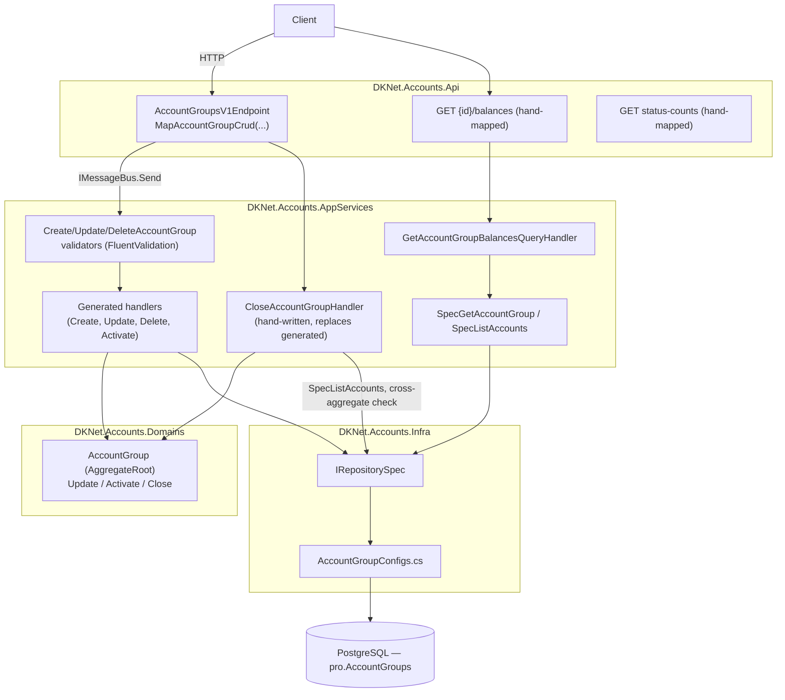
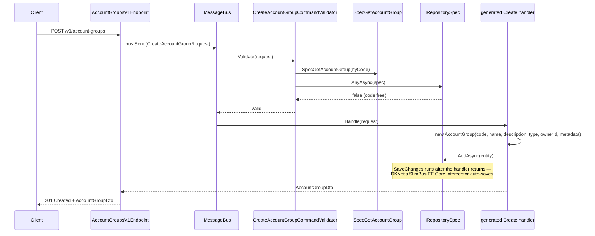
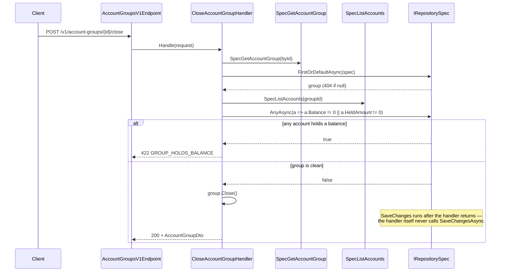
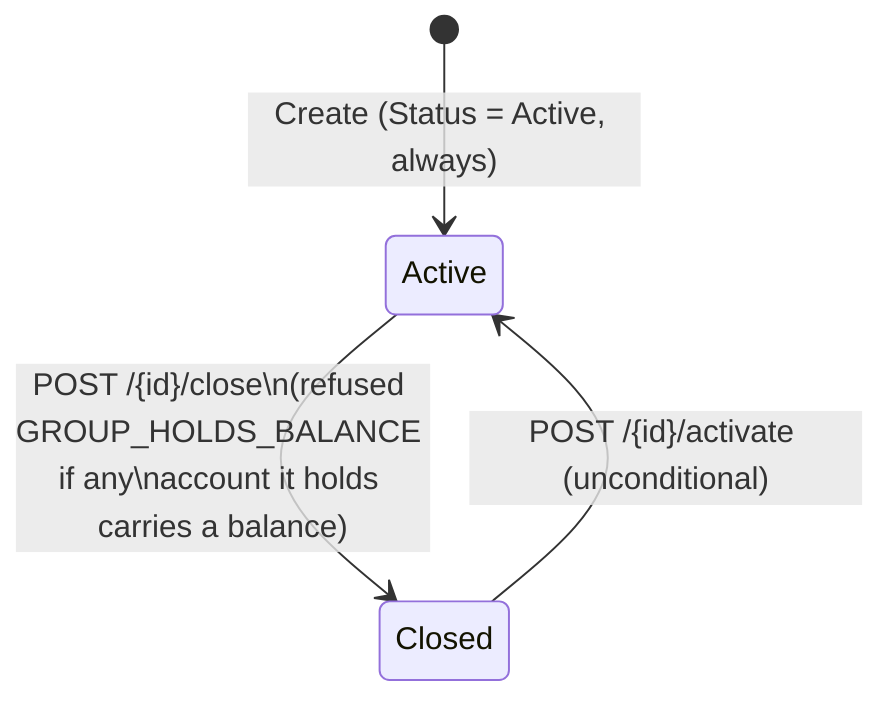

# Account Groups — Architecture

> Diagrams below are Mermaid, pending an archify render — no diagram is skipped.

## Vertical Slice Overview

Create, GetList, GetById, Update, Delete, Activate and Close are one generated composite
(`group.MapAccountGroupCrud(...)`). Balances and status-counts are hand-mapped reads beside it.

## Create Account Group — Sequence Diagram

## Close Account Group — Sequence Diagram

Close is the one route where the generated handler is replaced, because the refusal reads a
*different* aggregate (`Account`) than the one being closed:

## Status State Machine

`Delete` is not a transition on this diagram — it removes the row entirely, refused
(`GROUP_NOT_EMPTY`) while the group holds any account regardless of status.

## Layer Responsibilities

| Layer | Responsibility in this feature |
|-------|-------------------------------|
| `DKNet.Accounts.Api` | Composite route registration plus two hand-mapped reads (`balances`, `status-counts`); no business logic |
| `DKNet.Accounts.AppServices` | Validators (code uniqueness, non-empty update, empty-group delete); `CloseAccountGroupHandler`; `GetAccountGroupBalancesQueryHandler` |
| `DKNet.Accounts.Domains` | `AccountGroup` entity: `Update`, `Activate`, `Close` |
| `DKNet.Accounts.Infra` | `AccountGroupConfigs` EF mapping, including the `Metadata` JSON-string conversion |
