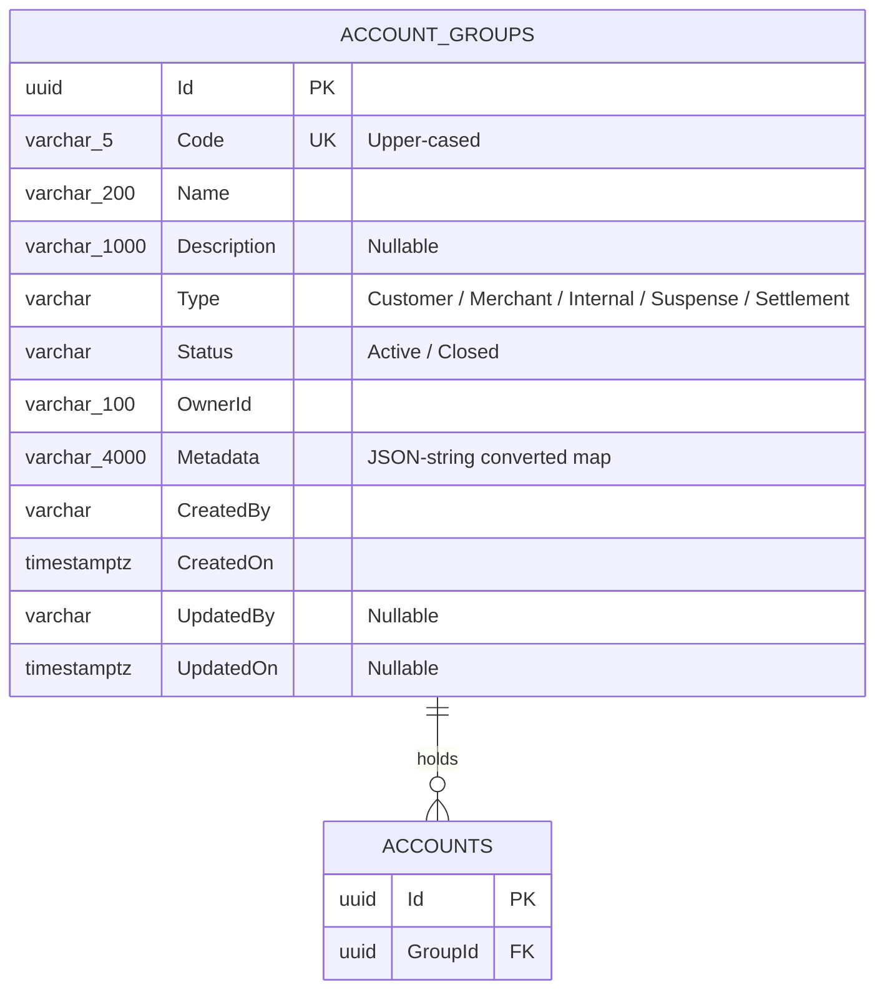

# Account Groups — Data Model

## Entity Relationship Diagram

`GroupId` on `Account` is a plain indexed column, not an EF Core navigation/foreign-key relationship —
the two aggregates are read together only through `SpecListAccounts(groupId: ...)`, never a `.Include(...)`.

## Properties

| Field | Column | DB type | Length / precision | Required | Key / index | Default | Purpose |
|---|---|---|---|---|---|---|---|
| `Id` | `Id` | uuid | — | ✓ | PK | new Guid | Service-generated identifier |
| `Code` | `Code` | varchar | 5 | ✓ | unique | — | Caller's own code, upper-cased; the create-time uniqueness check target |
| `Name` | `Name` | varchar | 200 | ✓ | — | — | Human-readable name |
| `Description` | `Description` | varchar | 1000 | — | — | — | Free-text description |
| `Type` | `Type` | varchar (`HasConversion<string>`) | — | ✓ | — | — | What the group represents; fixed at creation |
| `Status` | `Status` | varchar (`HasConversion<string>`) | — | ✓ | — | `Active` | Gates whether the group can hold new activity |
| `OwnerId` | `OwnerId` | varchar | 100 | ✓ | — | — | Caller's own identifier for who owns this group |
| `Metadata` | `Metadata` | varchar (JSON string, `MetadataConversion`) | 4000 | — | — | — | Free-form key/value pairs, round-tripped verbatim |
| `CreatedBy`/`UpdatedBy` | same | varchar | — | `CreatedBy` required, `UpdatedBy` nullable | — | — | Stamped by the audit hook, never by a request field |
| `CreatedOn`/`UpdatedOn` | same | timestamptz | — | `CreatedOn` required, `UpdatedOn` nullable | — | — | When the row was created/last touched |

`AccountGroupDto` (the API response shape) excludes `CreatedBy`/`CreatedOn`/`UpdatedBy`/`UpdatedOn` —
they exist as columns but are never returned over HTTP.

## EF Core Mapping Configuration

Source: `ApiEndpoints/DKNet.Accounts.Infra/Features/AccountGroups/Mappers/AccountGroupConfigs.cs`

| Configuration | Value | Reason |
|---|---|---|
| Table | `AccountGroups`, schema `pro` | Convention |
| Unique index | `Code` | Business uniqueness — a duplicate is `422 DUPLICATE_GROUP_CODE` |
| Enum storage | `Type`, `Status` as strings (`HasConversion<string>()`) | Readable in the database, stable across enum reordering |
| `Metadata` conversion | `MetadataConversion.Converter`/`.Comparer`, `HasMaxLength(4000)` | Dictionary stored as a JSON string column; the comparer lets EF Core's change tracker diff it correctly |

## Validation Rules

| Field | Rule | Enforcement |
|-------|------|-------------|
| `Code` | 3–5 characters, must not already exist | `CreateAccountGroupCommandValidator` (FluentValidation) |
| `Name` | Non-empty, ≤ 200 characters | `CreateAccountGroupCommandValidator` |
| `OwnerId` | Non-empty, ≤ 100 characters | `CreateAccountGroupCommandValidator` |
| `Type` | Must be a defined enum value | `CreateAccountGroupCommandValidator` |
| Update body | At least one of `name`/`description`/`metadata` must be supplied | `UpdateAccountGroupRequestValidator` |
| Delete | The group must hold no account | `DeleteAccountGroupRequestValidator` → `422 GROUP_NOT_EMPTY` |
| Close | Every account the group holds must carry a zero balance and zero held amount | `CloseAccountGroupHandler` → `422 GROUP_HOLDS_BALANCE` |

## Status Values

| Value | Meaning | Reached by | Next |
|-------|---------|------------|------|
| `Active` | Default; the group may hold and change accounts | Create (always), or `POST /{id}/activate` | `Closed` |
| `Closed` | Refused if any account it holds carries a balance or held amount | `POST /{id}/close` | `Active` |
