# Accounts

Where a balance lives — one currency, one classification, one posting stream.

## 📖 Overview

- **Every account has exactly one determinate floor.** An account not permitted to go negative has a floor of zero (or its minimum balance where higher); one permitted to go negative has a floor of its overdraft limit (or its minimum balance where higher) — permitting negative balances with no overdraft limit is refused outright, so no account is ever left without a floor.
- **Status gates postings, not just visibility.** A closed or frozen account accepts nothing; a dormant one accepts credits only — enforced on every posting and every reversal, not only at read time.
- **A balance is never a stored guess.** It is recomputed from the account's own postings by construction — `TryApplyPosting` is the only method that ever moves `Balance` or `StreamPosition`.
- Called by any system that opens accounts on behalf of a customer, merchant, or its own internal or settlement bookkeeping, and then posts to or reads back the accounts it opened.

## 🏢 Business domain

Accounts sits between [Account Groups](account-groups.md) (the ownership bucket) and [Postings](postings.md) (the movements that change a balance): every account belongs to exactly one group, in exactly one [currency](currencies.md), and every posting is always recorded against exactly one account, in that account's own currency.

| Term | Meaning | In the code |
|---|---|---|
| `accountNumber` | Service-allocated, `{group code}-{suffix}` — the caller may supply the suffix (3–10 characters) or let the service generate one | `Account.AccountNumber`, unique index |
| The floor | The most restrictive of the account's controls — see the rule below | `AccountFloorPolicy.Floor(...)`, computed live, never stored |
| `availableBalance` / `heldAmount` | Always equal to `balance` / `0` in this delivery — the fields exist, held-funds behaviour does not | `Account.AvailableBalance` (computed), `Account.HeldAmount` |
| `status` | `Active`, `Frozen`, `Dormant`, `Closed` | `AccountStatus`, gates every posting via `AccountPostingPolicy.StatusGate` |

| Rule | Enforced by | A caller who breaks it gets |
|---|---|---|
| Permitting negative balances with no overdraft limit is refused | `AccountFloorPolicy.RequiresOverdraftLimit`, checked at Open and at `PATCH` | `422 OVERDRAFT_LIMIT_REQUIRED` |
| A closed account accepts no posting, and can't be closed while it holds a balance or held amount | `AccountPostingPolicy.StatusGate` / `UpdateAccountCommandHandler` | `422 ACCOUNT_CLOSED` / `422 ACCOUNT_HOLDS_BALANCE` |
| A frozen account accepts nothing in either direction | `AccountPostingPolicy.StatusGate` | `422 ACCOUNT_FROZEN` |
| A dormant account accepts credits only | `AccountPostingPolicy.StatusGate` | `422 ACCOUNT_DORMANT_DEBIT_REFUSED` |
| The account's currency must resolve to an active one, and never changes after open | `OpenAccountCommandHandler` | `422 UNSUPPORTED_CURRENCY` |

## 🚀 Quick Start

Get a JWT bearer token from your issuer, carrying `scp` (or `scope`) `accounts.write` (opening) and `accounts.read` (reading it back) — see [Getting a token](../integration-guide.md#before-you-start) or, for a local instance, [Local setup with Microsoft Entra ID](../local-setup-entra.md).

```http
POST /v1/accounts
Content-Type: application/json
Authorization: Bearer {token}

{
  "groupId": "b85813c0-3053-4d35-a0ef-3f2863f83fa9",
  "name": "Acme Operating — SGD",
  "currency": "SGD",
  "classification": "Asset",
  "permittedToGoNegative": false
}
```

```http
GET /v1/accounts/{id}/balance
Authorization: Bearer {token}
```

```json
{ "currency": "SGD", "balance": 0.00, "availableBalance": 0.00, "heldAmount": 0.00, "floor": 0.00 }
```

## 🔄 End-to-end flow

Unlike Currencies and Account Groups, **Open is entirely hand-written** — `Account` carries no `[CrudCreate]` constructor, because account-number allocation and the currency/floor checks are handler logic, not something a generator can express from a request shape alone.


The entity and its outbox row commit in the one `SaveChanges` call DKNet's SlimBus EF Core interceptor runs after the handler returns. This diagram can't show a posting being recorded against the account afterward — that flow, including the status gate and floor check `TryApplyPosting` runs, lives in [Postings' end-to-end flow](postings.md#-end-to-end-flow), since the rules are the account's own but the write is a posting.


`ChangeStatus` assigns the requested value unconditionally; there is no ordering between the four states, so every one of the twelve directed moves among them is reachable in a single `PATCH`. The one guard `UpdateAccountCommandHandler` applies is on the *target*: entering `Closed` is refused (`ACCOUNT_HOLDS_BALANCE`) while the balance or held amount is non-zero, whatever the current status was. `Frozen` accepts no posting in either direction; `Dormant` accepts credits only — enforced by `AccountPostingPolicy.StatusGate` on every posting and reversal, not by the `PATCH` route itself.

## 🔌 Endpoints

Only `GetList`, `GetById` and rename/metadata (`ChangeDetails`) come from the generated composite (`group.MapAccountCrud(o => o.Exclude(CrudOp.Delete))`) — accounts publish no delete route at all. Every other route below is hand-mapped.

| Verb | Path | Purpose | Auth |
|---|---|---|---|
| `POST` | `/v1/accounts` | Open an account | `accounts.write` |
| `GET` | `/v1/accounts` | List accounts (filter/search/order/page) | `accounts.read` |
| `GET` | `/v1/accounts/status-counts` | Count accounts by status | `accounts.read` |
| `GET` | `/v1/accounts/balances` | Ledger-wide balances by currency | `accounts.read` |
| `GET` | `/v1/accounts/{id}` | Read one account | `accounts.read` |
| `PUT` | `/v1/accounts/{id}` | Change name/metadata | `accounts.write` |
| `GET` | `/v1/accounts/{id}/balance` | The three money fields plus currency and floor | `accounts.read` |
| `PATCH` | `/v1/accounts/{id}` | Change status/overdraft limit/minimum balance/permitted-negative | `accounts.write` |
| `GET` | `/v1/accounts/{id}/statement` | Date-bounded, paged posting statement — mapped on this group but documented on [Postings](postings.md#get-v1accountsidstatement), since it reads the posting stream, not the account record | `postings.read` |

### `POST /v1/accounts`

Opens an account. Entirely hand-written — `Account` carries no `[CrudCreate]` constructor.

- **Auth:** `accounts.write`
- **Idempotency:** not idempotent — a retry opens a second account unless a caller-chosen `accountNumber` suffix repeats, which is refused by the unique index (`409`)
- **Request:**

  | Field | Type | Required | Rules | From |
  |---|---|---|---|---|
  | `groupId` | uuid | ✓ | must resolve to an existing group | body |
  | `accountNumber` | string | — | caller's own 3–10 character suffix; stored as `{group code}-{suffix}`. Omitted, a 10-digit suffix is generated | body |
  | `name` | string | ✓ | non-empty, ≤ 200 characters | body |
  | `currency` | string | ✓ | must resolve to an active currency | body |
  | `classification` | enum | ✓ | `Asset`, `Liability`, `Equity`, `Income`, `Expense` | body |
  | `permittedToGoNegative` | bool | ✓ | if `true`, `overdraftLimit` becomes required | body |
  | `overdraftLimit` | decimal | — | required when `permittedToGoNegative` is `true`; decimal places ≤ currency's | body |
  | `minimumBalance` | decimal | — | decimal places ≤ currency's | body |
  | `externalReference` | string | — | ≤ 200 characters — a **column limit only**, not validated | body |
  | `metadata` | map\<string,string\> | — | round-trips verbatim | body |

- **Response:** `201 Created` — `AccountDto`, `status: "active"`, `balance: 0`
- **Errors:**

  | Status | Code | When |
  |---|---|---|
  | `400` | — | Malformed body |
  | `404` | — | Unknown group |
  | `409` | — | A caller-chosen suffix already used with this group's code |
  | `422` | `UNSUPPORTED_CURRENCY` | Unknown or inactive currency |
  | `422` | `OVERDRAFT_LIMIT_REQUIRED` | `permittedToGoNegative: true` with no `overdraftLimit` |
  | `422` | `AMOUNT_OUT_OF_RANGE` | `overdraftLimit`/`minimumBalance` beyond 999,999,999,999.999999 |
  | `422` | `INVALID_LIMIT_AMOUNT` | `overdraftLimit`/`minimumBalance` finer than the currency's decimal places |

- **Example:**

```bash
curl -X POST "https://accounts.example.com/v1/accounts" \
  -H "Authorization: Bearer $TOKEN" -H "Content-Type: application/json" \
  -d '{"groupId":"b85813c0-3053-4d35-a0ef-3f2863f83fa9","name":"Acme Operating — SGD","currency":"SGD","classification":"Asset","permittedToGoNegative":false}'
```

### `GET /v1/accounts`

Generated `MapGetList<Account, Guid, AccountDto>()` route. Full contract: [Generic List Endpoint](../generic-list-endpoint.md); this service's queryable fields and defaults: [the root README](../../README.md#listing-groups-and-accounts).

- **Auth:** `accounts.read`
- **Response:** `200 OK` — `PagedResponse<AccountDto>`
- **Errors:**

  | Status | Code | When |
  |---|---|---|
  | `400` | — | Unknown filter/order field, or a malformed filter triple |

- **Example:**

```bash
curl -H "Authorization: Bearer $TOKEN" "https://accounts.example.com/v1/accounts?filter=GroupId:Equal:{groupId}"
```

### `GET /v1/accounts/status-counts`

Generic `MapGetStatusCounts<Account>` helper.

- **Auth:** `accounts.read`
- **Request:** `from`/`to` (RFC 3339, optional) — narrows by `CreatedOn`
- **Response:** `200 OK` — `[{ type, status, count }]`. `type` is `"AccountStatus"`; `status` is **upper-cased** (`"ACTIVE"`), unlike every other enum this API returns. Every `AccountStatus` value is included even at zero
- **Errors:**

  | Status | Code | When |
  |---|---|---|
  | `400` | — | A narrowing other than the date window |

- **Example:**

```bash
curl -H "Authorization: Bearer $TOKEN" "https://accounts.example.com/v1/accounts/status-counts"
```

### `GET /v1/accounts/balances`

Hand-written aggregation (`GetLedgerBalancesQueryHandler`): every account across every group, grouped by `CurrencyCode`.

- **Auth:** `accounts.read`
- **Response:** `200 OK` — `[{ currency, balance, available, held }]` — one line per currency across the whole ledger, currencies never combined
- **Errors:** none beyond auth
- **Example:**

```bash
curl -H "Authorization: Bearer $TOKEN" "https://accounts.example.com/v1/accounts/balances"
```

### `GET /v1/accounts/{id}`

- **Auth:** `accounts.read`
- **Response:** `200 OK` — `AccountDto`
- **Errors:**

  | Status | Code | When |
  |---|---|---|
  | `400` | — | Malformed id |
  | `404` | — | Unknown id |

- **Example:**

```bash
curl -H "Authorization: Bearer $TOKEN" "https://accounts.example.com/v1/accounts/{id}"
```

### `PUT /v1/accounts/{id}`

Changes `name` and/or `metadata` only — generated route (`ChangeDetails`, `[CrudUpdate]`), hand-written validator.

- **Auth:** `accounts.write`
- **Idempotency:** not idempotent in the retry sense, but naturally repeatable — resending the same body is a no-op that returns the same `200`
- **Request:** `name` (string, ≤ 200, when supplied), `metadata` (map, optional) — at least one required
- **Response:** `200 OK` — `AccountDto`
- **Errors:**

  | Status | Code | When |
  |---|---|---|
  | `400` | — | No member supplied, or malformed id |
  | `404` | — | Unknown id |

- **Example:**

```bash
curl -X PUT "https://accounts.example.com/v1/accounts/{id}" \
  -H "Authorization: Bearer $TOKEN" -H "Content-Type: application/json" \
  -d '{"name":"Acme Operating — SGD (renamed)"}'
```

### `GET /v1/accounts/{id}/balance`

Narrow read: the three money fields plus currency and the account's live floor.

- **Auth:** `accounts.read`
- **Response:** `200 OK` — `{ currency, balance, availableBalance, heldAmount, floor }`. `heldAmount` is always `0` and `availableBalance` always equals `balance` in this delivery. `floor` is computed live from `AccountFloorPolicy.Floor(...)`, never stored
- **Errors:**

  | Status | Code | When |
  |---|---|---|
  | `404` | — | Unknown id |

- **Example:**

```bash
curl -H "Authorization: Bearer $TOKEN" "https://accounts.example.com/v1/accounts/{id}/balance"
```

### `PATCH /v1/accounts/{id}`

Changes `status`, `overdraftLimit`, `minimumBalance` and `permittedToGoNegative` **only** — rename and metadata are on `PUT`, not here.



- **Auth:** `accounts.write`
- **Idempotency:** not idempotent in the retry sense, but naturally repeatable — resending the same body is a no-op that returns the same `200`, since `ChangeStatus` and the floor setters simply reassign the same values
- **Request:**

  | Field | Type | Required | Rules | From |
  |---|---|---|---|---|
  | `status` | enum | — | any of `Active`, `Frozen`, `Dormant`, `Closed`; a member left out is unchanged | body |
  | `overdraftLimit` | decimal | — | re-checked against the merged floor state | body |
  | `minimumBalance` | decimal | — | decimal places ≤ currency's | body |
  | `permittedToGoNegative` | bool | — | re-checked against the merged floor state | body |

- **Response:** `200 OK` — `AccountDto`
- **Errors:**

  | Status | Code | When |
  |---|---|---|
  | `404` | — | Unknown id |
  | `422` | `ACCOUNT_HOLDS_BALANCE` | `status: "Closed"` requested while balance or held amount is non-zero |
  | `422` | `OVERDRAFT_LIMIT_REQUIRED` | The merged permission/limit leaves no determinate floor |
  | `422` | `AMOUNT_OUT_OF_RANGE` | `overdraftLimit`/`minimumBalance` beyond 999,999,999,999.999999 |
  | `422` | `INVALID_LIMIT_AMOUNT` | `overdraftLimit`/`minimumBalance` finer than the currency's decimal places |

- **Example:**

```bash
curl -X PATCH "https://accounts.example.com/v1/accounts/{id}" \
  -H "Authorization: Bearer $TOKEN" -H "Content-Type: application/json" \
  -d '{"status":"Closed"}'
```

## 🗃️ Data model

### Account — `pro.Accounts`

One row is one single-currency account, its floor controls and its live posting-stream position.

| Field | Column | DB type | Length / precision | Required | Key / index | Default | Purpose |
|---|---|---|---|---|---|---|---|
| `Id` | `Id` | uuid | — | ✓ | PK | new Guid | Service-generated identifier |
| `AccountNumber` | `AccountNumber` | varchar | 32 | ✓ | unique | — | `{group code}-{suffix}`; the account's own external-facing number |
| `GroupId` | `GroupId` | uuid | — | ✓ | indexed | — | Cross-aggregate reference to `AccountGroup.Id`, read via `SpecListAccounts`, never navigated |
| `Name` | `Name` | varchar | 200 | ✓ | — | — | Human-readable name |
| `CurrencyCode` | `CurrencyCode` | varchar | 10 | ✓ | — | — | Fixed at open, immutable once set — no method changes it |
| `Classification` | `Classification` | text (`HasConversion<string>`) | — | ✓ | — | — | Fixes which side of the ledger a credit increases (see [Postings' signed amount resolution](postings.md#signed-amount-resolution)) |
| `Status` | `Status` | text (`HasConversion<string>`) | — | ✓ | — | `Active` | Governs which postings the account accepts |
| `Balance` | `Balance` | decimal | 18,6 | ✓ | — | `0` | The signed sum of the account's own postings |
| `HeldAmount` | `HeldAmount` | decimal | 18,6 | ✓ | — | `0` | Reserved but unsettled funds — always `0`, held-funds behaviour is deferred |
| `OverdraftLimit` | `OverdraftLimit` | decimal | 18,6 | — | — | — | How far below zero the account may go, when `PermittedToGoNegative` |
| `MinimumBalance` | `MinimumBalance` | decimal | 18,6 | — | — | — | A floor the account may not fall below; binds over a looser overdraft limit |
| `PermittedToGoNegative` | `PermittedToGoNegative` | bool | — | ✓ | — | — | Whether the account may hold a negative balance at all |
| `StreamPosition` | `StreamPosition` | bigint | — | ✓ | — | `0` | The highest position reached in this account's posting stream |
| `LastPostedOn` | `LastPostedOn` | timestamptz | — | — | — | — | Absent until the first posting |
| `ExternalReference` | `ExternalReference` | varchar | 200 | — | — | — | Caller's own reference for this account |
| `Metadata` | `Metadata` | varchar (JSON string) | 4000 | — | — | — | Free-form key/value pairs |
| `ClosedOn` | `ClosedOn` | timestamptz | — | — | — | — | Set when `Status` becomes `Closed`; cleared back to `null` on any other status change |
| `CreatedBy` / `UpdatedBy` | same | varchar | 255 | `CreatedBy` required, `UpdatedBy` nullable | — | — | Stamped by the audit hook, never by a request field |
| `CreatedOn` / `UpdatedOn` | same | timestamptz | — | `CreatedOn` required, `UpdatedOn` nullable | — | — | When the row was created / last touched |

`AvailableBalance` and `OpenedOn` are **not** stored columns — both are expression-bodied computed properties (`AvailableBalance => Balance`, `OpenedOn => CreatedOn`), `Ignore`d in `AccountConfigs.cs`, and not queryable through the generic list route. `Account 1 — n Posting` via `Posting.AccountId`, a plain indexed column, not a mapped EF Core relationship.

| Status | Meaning | Reached by | Next |
|---|---|---|---|
| `Active` | Accepts every posting direction | Open (always), or `PATCH {status: "Active"}` from any other value | `Frozen`, `Dormant`, `Closed` |
| `Frozen` | Accepts no posting in either direction, including a reversal | `PATCH {status: "Frozen"}` from any other value | `Active`, `Dormant`, `Closed` |
| `Dormant` | Accepts credits only; a debit (including a debiting reversal) is refused | `PATCH {status: "Dormant"}` from any other value | `Active`, `Frozen`, `Closed` |
| `Closed` | Accepts no posting; refused while balance or held amount is non-zero | `PATCH {status: "Closed"}` from any other value, refused if balance or held amount ≠ 0 | `Active`, `Frozen`, `Dormant` |

## 📣 Events

Declared on `Account` with `[RaisesEvent]` (DRK-1773 §3a) and raised by the DKNet EF Core save hook. `accounts.updated` fires **only** when the account's own details, status or controls change — never on a posting's balance movement alone (R4), since a posting mutates `Balance`/`StreamPosition` through a different save path that isn't in the event's tracked-field list.

| Event | Raised when | Payload | Transport | Consumers |
|---|---|---|---|---|
| `accounts.created` | An account is opened | `id`, `accountNumber`, `groupId`, `name`, `currencyCode`, `classification`, `status`, `balance`, `heldAmount`, `overdraftLimit`, `minimumBalance`, `permittedToGoNegative`, `streamPosition`, `lastPostedOn`, `externalReference`, `metadata`, `closedOn`, `createdBy`, `createdOn`, `updatedBy`, `updatedOn` | `ledger-events` queue | Any system subscribed to the outbound queue |
| `accounts.updated` | `name`, `metadata`, `externalReference`, `status`, `closedOn`, `overdraftLimit`, `minimumBalance` or `permittedToGoNegative` changes (`PUT` or `PATCH`) | Same field set, current values | `ledger-events` queue | Any system subscribed to the outbound queue |

Every event is wrapped as `{ "type": "accounts.created", "payload": { ... } }` (`OutboundEnvelope`), stored in the same database save as the change, and sent over Azure Service Bus or RabbitMQ depending on `MessageBus:Transport`. With the message bus off, an event is dropped: nothing is stored and nothing is sent, but the change itself still succeeds. With the bus on but the broker unreachable, the event waits in the outbox and is retried every 10 seconds, without limit, until it is delivered.

## 🌐 Downstream systems

| System | Direction | How | What for | When it is down |
|---|---|---|---|---|
| Any subscriber to `ledger-events` | it consumes our events | Azure Service Bus queue (production) or RabbitMQ fanout exchange + queue (local/integration), both named by `MessageBus:OutboundQueue` (default `ledger-events`) | Learn an account was opened, renamed, or had its status or controls changed | Event is retried from the PostgreSQL outbox every 10 seconds, indefinitely |

Configuration keys: `FeatureManagement:EnableServiceBus`, `MessageBus:Transport`, `MessageBus:OutboundQueue`, `ConnectionStrings:AzureBus` / `ConnectionStrings:RabbitMq`.

## ⚙️ Configuration reference

| Key | Type | Default | Effect |
|---|---|---|---|
| `MessageBus:Transport` | enum | `AzureServiceBus` | Which broker `accounts.*` events are sent on |
| `MessageBus:OutboundQueue` | string | `ledger-events` | The queue/exchange every outbound event, this feature's included, is sent to |
| `FeatureManagement:EnableServiceBus` | bool | `true` | External bus wiring. Off means every event is dropped, not queued |

## ⚠️ Errors & limits

Every non-2xx response is `application/problem+json` — `title`, `status`, `type`, `traceId`, and an `errors[]` list of `{ message, code, field }`. Full shape and the complete refusal-code table: [the root README](../../README.md#refusals-and-error-codes).

- **No delete route exists** for accounts at all — an account is closed, never removed.
- **`externalReference` has no length validator** — its 200-character bound is a database column limit, so an over-long value fails when the row is saved, not with a clean `400`.
- **`heldAmount` is always `0` and `availableBalance` always equals `balance`** in this delivery — held-funds behaviour is deferred, the fields exist so the addition is purely behavioural later.
- **The floor is never stored** — it is recomputed live from the account's current controls on every read and every write that could change it.

## 🔗 Related features

- [Account Groups](account-groups.md) — every account belongs to exactly one group.
- [Currencies](currencies.md) — every account opens in exactly one currency, and `CurrencyCode` is immutable once set.
- [Postings](postings.md) — every posting is recorded against exactly one account, and the statement route (`GET {id}/statement`) is documented there.
- [Accounts client (.NET)](../accounts-client.md) — reach for the `DKNet.Accounts.Client` NuGet package when calling this and the other three features from a .NET caller instead of raw HTTP.
