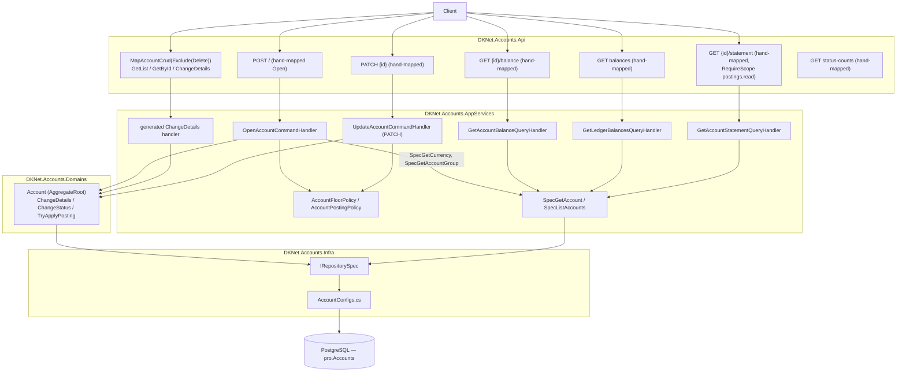
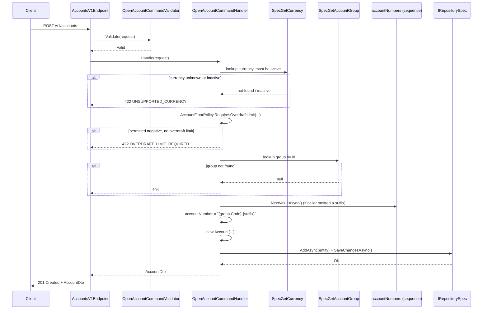
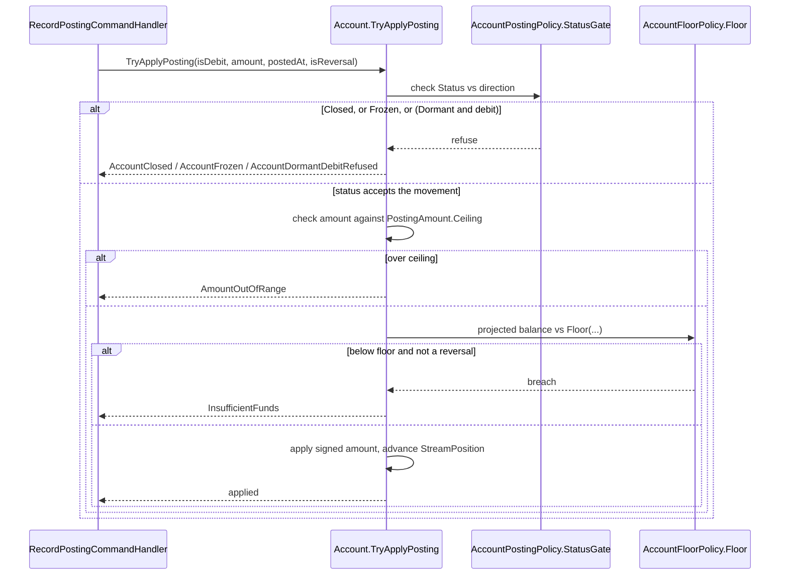
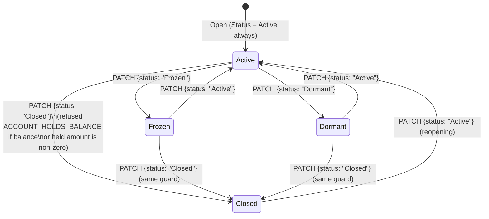

# Accounts — Architecture

> Diagrams below are Mermaid, pending an archify render — no diagram is skipped.

## Vertical Slice Overview

Unlike Currencies and Account Groups, **Open is entirely hand-written** — `Account` carries no
`[CrudCreate]` constructor. `GetList`, `GetById` and rename/metadata (`ChangeDetails`) are the one
generated composite; every other route (balance, statement, status-counts, ledger balances, the
`PATCH` status/floor route) is hand-mapped.

## Open Account — Sequence Diagram

## Record a Posting Against an Account — Sequence Diagram

The status gate and floor check that guard every posting live on `Account`, not on `Posting` — shown
here because they are this entity's own domain rules; the full posting flow is in
[Postings' architecture](../postings/architecture.md).

## Status State Machine

Every transition below is reachable through `PATCH {id}` with `{"status": "<Value>"}`; only the move
to `Closed` is guarded.

`Frozen` accepts no posting in either direction; `Dormant` accepts credits only — enforced by
`AccountPostingPolicy.StatusGate` on every posting and reversal, not by this route.

## Layer Responsibilities

| Layer | Responsibility in this feature |
|-------|-------------------------------|
| `DKNet.Accounts.Api` | One hand-mapped Open route, one generated composite (list/read/rename), five further hand-mapped reads/writes; no business logic |
| `DKNet.Accounts.AppServices` | `OpenAccountCommandHandler` (account-number allocation, currency/floor checks), `UpdateAccountCommandHandler` (status/floor recheck), balance/statement queries |
| `DKNet.Accounts.Domains` | `Account` entity, `AccountFloorPolicy`, `AccountPostingPolicy` — the floor and status-gate rules every posting and every `PATCH` goes through |
| `DKNet.Accounts.Infra` | `AccountConfigs` EF mapping, including the two `Ignore`d computed properties |
