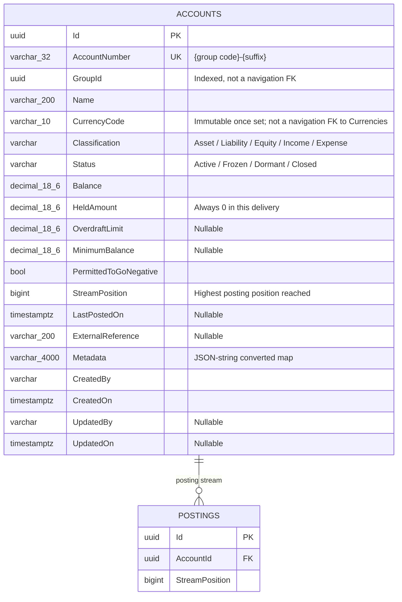

# Accounts — Data Model

## Entity Relationship Diagram

`AvailableBalance` and `OpenedOn` are **not** in this diagram: both are expression-bodied computed
properties (`AvailableBalance => Balance`, `OpenedOn => CreatedOn`) and are `builder.Ignore(...)`-ed in
`AccountConfigs.cs` — not stored columns, and not queryable through the generic list route (see
[the trap](../../generic-list-endpoint.md#trap-a-dto-field-must-map-to-a-real-column)).

## Properties

| Field | Column | DB type | Length / precision | Required | Key / index | Default | Purpose |
|---|---|---|---|---|---|---|---|
| `Id` | `Id` | uuid | — | ✓ | PK | new Guid | Service-generated identifier |
| `AccountNumber` | `AccountNumber` | varchar | 32 | ✓ | unique | — | `{group code}-{suffix}`; the account's own external-facing number |
| `GroupId` | `GroupId` | uuid | — | ✓ | indexed | — | Cross-aggregate reference to `AccountGroup.Id`, read via `SpecListAccounts`, never navigated |
| `Name` | `Name` | varchar | 200 | ✓ | — | — | Human-readable name |
| `CurrencyCode` | `CurrencyCode` | varchar | 10 | ✓ | — | — | Fixed at open, immutable once set — no method changes it |
| `Classification` | `Classification` | varchar (`HasConversion<string>`) | — | ✓ | — | — | Fixes which side of the ledger a credit increases (see [Postings' sign resolution](../postings/data-model.md#signed-amount-resolution)) |
| `Status` | `Status` | varchar (`HasConversion<string>`) | — | ✓ | — | `Active` | Governs which postings the account accepts |
| `Balance` | `Balance` | decimal | 18,6 | ✓ | — | `0` | The signed sum of the account's own postings |
| `HeldAmount` | `HeldAmount` | decimal | 18,6 | ✓ | — | `0` | Reserved but unsettled funds — always `0`, held-funds behaviour is deferred |
| `OverdraftLimit` | `OverdraftLimit` | decimal | 18,6 | — | — | — | How far below zero the account may go, when `PermittedToGoNegative` |
| `MinimumBalance` | `MinimumBalance` | decimal | 18,6 | — | — | — | A floor the account may not fall below; binds over a looser overdraft limit |
| `PermittedToGoNegative` | `PermittedToGoNegative` | bool | — | ✓ | — | — | Whether the account may hold a negative balance at all |
| `StreamPosition` | `StreamPosition` | bigint | — | ✓ | — | `0` | The highest position reached in this account's posting stream |
| `LastPostedOn` | `LastPostedOn` | timestamptz | — | — | — | — | Absent until the first posting |
| `ExternalReference` | `ExternalReference` | varchar | 200 | — | — | — | Caller's own reference for this account |
| `Metadata` | `Metadata` | varchar (JSON string) | 4000 | — | — | — | Free-form key/value pairs |
| `CreatedBy`/`UpdatedBy` | same | varchar | — | `CreatedBy` required, `UpdatedBy` nullable | — | — | Stamped by the audit hook, never by a request field |
| `CreatedOn`/`UpdatedOn` | same | timestamptz | — | `CreatedOn` required, `UpdatedOn` nullable | — | — | When the row was created/last touched |

`AccountDto` excludes `CurrencyCode`, `AvailableBalance`, `OpenedOn` and the four audit fields from the
generated shape, then re-declares `Currency` (Mapster-renamed from `CurrencyCode`), `availableBalance`
and `openedOn` by hand — a `CurrencyCode` property is re-added to the DTO too, `[JsonIgnore]`d and
never serialized, solely so the generic list route can resolve `filter=CurrencyCode:...` against a
real mapped column. Full story: [the README](../../../README.md#listing-groups-and-accounts).

## EF Core Mapping Configuration

Source: `ApiEndpoints/DKNet.Accounts.Infra/Features/Accounts/Mappers/AccountConfigs.cs`

| Configuration | Value | Reason |
|---|---|---|
| Table | `Accounts`, schema `pro` | Convention |
| Unique index | `AccountNumber` | A caller-chosen suffix that collides is refused via this index, surfaced as `409` |
| Enum storage | `Classification`, `Status` as strings | Readable in the database, stable across enum reordering |
| Money precision | `Balance`, `HeldAmount`, `OverdraftLimit`, `MinimumBalance` → `HasPrecision(18, 6)` | Matches `PostingAmount.Ceiling` (999,999,999,999.999999) and every currency's maximum 6 decimal places |
| Ignored properties | `AvailableBalance`, `OpenedOn` | Computed, not stored — see the ER diagram note above |
| `Metadata` conversion | `MetadataConversion.Converter`/`.Comparer`, `HasMaxLength(4000)` | Dictionary stored as a JSON string column |

## Validation Rules

| Field | Rule | Enforcement |
|-------|------|-------------|
| `currency` | Must resolve to an active currency | `OpenAccountCommandHandler` → `422 UNSUPPORTED_CURRENCY` |
| `permittedToGoNegative` + `overdraftLimit` | Permitting negative with no overdraft limit is refused | `AccountFloorPolicy.RequiresOverdraftLimit` → `422 OVERDRAFT_LIMIT_REQUIRED`, checked at Open and at `PATCH` |
| `overdraftLimit` / `minimumBalance` | Decimal places ≤ the account's currency | `LedgerLimit` FluentValidation rule → `422 INVALID_LIMIT_AMOUNT` or `422 AMOUNT_OUT_OF_RANGE` |
| Close (`status: "Closed"`) | Balance and held amount must both be zero | `UpdateAccountCommandHandler` → `422 ACCOUNT_HOLDS_BALANCE` |
| `PUT` body | At least one of `name`/`metadata` must be supplied | `ChangeDetailsAccountRequestValidator` |

## Status Values

| Value | Meaning | Reached by | Next |
|-------|---------|------------|------|
| `Active` | Accepts every posting direction | Open (always), or `PATCH {status: "Active"}` from any other value | `Frozen`, `Dormant`, `Closed` |
| `Frozen` | Accepts no posting in either direction, including a reversal | `PATCH {status: "Frozen"}` | `Active`, `Closed` |
| `Dormant` | Accepts credits only; a debit (including a debiting reversal) is refused | `PATCH {status: "Dormant"}` | `Active`, `Closed` |
| `Closed` | Accepts no posting; refused while balance or held amount is non-zero | `PATCH {status: "Closed"}` | `Active` (reopening) |
