# Currencies

The reference list of currencies a caller can denominate accounts and postings in, and the precision each one is validated against.

## 📖 Overview

- **A currency is a stored, editable row, not a hard-coded table.** Registering `USDT` at 6 decimal places is a `POST`, not a deploy — the same way a fiat currency like `SGD` is registered.
- **Every posting amount is checked against its currency's precision.** `10.555 USD` is refused because USD is denominated to 2 decimal places; a currency's `decimalPlaces` is fixed for life once registered, so every amount ever posted in it stays comparable.
- **A currency is retired, never deleted.** Deactivating blocks new accounts and postings in it. Existing accounts and posting records remain, and there is no delete route.
- Called by any system integrating with the ledger — most often at onboarding time, to look up or register the currencies it will open accounts in.

## 🏢 Business domain

Currencies is reference data that [Accounts](accounts.md) and [Postings](postings.md) both depend on: an account is opened in exactly one currency, and every posting amount is validated against that currency's precision. It does not overlap the accounting side of the ledger — it never holds a balance itself.

| Term | Meaning | In the code |
|---|---|---|
| `code` | The currency's identity, upper-cased on write so lookups are case-insensitive | `Currency.Code`, unique index `IX_Currencies_Code` |
| `decimalPlaces` | How many decimal places this currency is legally denominated to; fixed at registration | `Currency.DecimalPlaces` |
| `isActive` | Whether new accounts may open in this currency — an account-opening gate, not a visibility flag | `Currency.IsActive` |

| Rule | Enforced by | A caller who breaks it gets |
|---|---|---|
| `code` must be unique (case-insensitive) | `CreateCurrencyCommandValidator` | `422 DUPLICATE_CURRENCY_CODE` |
| `decimalPlaces` is immutable after registration | No `ChangeDecimalPlaces` method exists on `Currency` — enforced by omission | Not applicable — there is no route that could attempt it |
| A currency can't be deactivated while an account in it holds a balance | `DeactivateCurrencyHandler`, a cross-aggregate check against `Account` | `422 CURRENCY_HOLDS_BALANCE` |

## 🚀 Quick Start

Get a JWT bearer token from your issuer, carrying `scp` (or `scope`) `accounts.read` (listing) and `accounts.write` (registering) — see [Getting a token](../integration-guide.md#before-you-start) or, for a local instance, [Local setup with Microsoft Entra ID](../local-setup-entra.md).

```http
GET /v1/currencies?pageSize=2
Authorization: Bearer {token}
```

With no `orderBy`, the default is `CreatedOn` descending then `Id` descending ([the generic list contract](../generic-list-endpoint.md#ordering)); every seeded currency shares one `CreatedOn`, so the tie-break alone decides the order — `USDT` (`c0de0002-…`) sorts above every `c0de0001-…` fiat code, and `EUR` (`…000978`) is the highest-numbered of those:

```json
{
  "items": [
    { "id": "c0de0002-0000-4000-8000-000000000001", "code": "USDT", "name": "Tether USD", "decimalPlaces": 6, "isActive": true },
    { "id": "c0de0001-0000-4000-8000-000000000978", "code": "EUR", "name": "Euro", "decimalPlaces": 2, "isActive": true }
  ],
  "pageCount": 13,
  "pageNumber": 1,
  "pageSize": 2,
  "totalItemCount": 26,
  "hasNextPage": true,
  "hasPreviousPage": false
}
```

```http
POST /v1/currencies
Content-Type: application/json
Authorization: Bearer {token}

{ "code": "XAU", "name": "Gold (troy ounce)", "decimalPlaces": 4 }
```

## 🔄 End-to-end flow

The whole slice — Create, List, Get, Rename, Activate, Deactivate — rides one generated composite route (`group.MapCurrencyCrud(o => o.Exclude(CrudOp.Delete))`), except Deactivate, whose generated handler is replaced by a hand-written one.


The currency commits in the `SaveChanges` call that DKNet's SlimBus EF Core interceptor runs after the handler returns. When messaging is enabled, its outbox row commits in that same save. If the broker is unreachable, the outbox retries delivery every 10 seconds without failing the currency write (see [📣 Events](#-events)).

`IsActive` is a plain boolean, but it does gate behaviour — new accounts may only open in an active currency:



## 🔌 Endpoints

| Verb | Path | Purpose | Auth |
|---|---|---|---|
| `GET` | `/v1/currencies` | List currencies (filter/search/order/page) | `accounts.read` |
| `GET` | `/v1/currencies/{id}` | Read one currency | `accounts.read` |
| `POST` | `/v1/currencies` | Register a currency | `accounts.write` |
| `PUT` | `/v1/currencies/{id}` | Rename a currency | `accounts.write` |
| `POST` | `/v1/currencies/{id}/activate` | Reactivate a currency | `accounts.write` |
| `POST` | `/v1/currencies/{id}/deactivate` | Deactivate a currency | `accounts.write` |

### `GET /v1/currencies`

Lists currencies. Generated `MapGetList<Currency, Guid, CurrencyDto>()` route — full filter/search/order/page contract: [Generic List Endpoint](../generic-list-endpoint.md).

- **Auth:** `accounts.read`
- **Request:** none of its own — shares the generic list query surface ([Listing groups and accounts](../api-contract.md#listing-groups-and-accounts))
- **Response:** `200 OK` — `PagedResponse<CurrencyDto>`
- **Errors:**

  | Status | Code | When |
  |---|---|---|
  | `400` | — | Unknown filter/order field, or a malformed filter triple |

- **Example:**

```bash
curl -H "Authorization: Bearer $TOKEN" "https://accounts.example.com/v1/currencies?pageSize=50"
```

### `GET /v1/currencies/{id}`

Reads one currency.

- **Auth:** `accounts.read`
- **Request:** `id` (uuid, route)
- **Response:** `200 OK` — `CurrencyDto`
- **Errors:**

  | Status | Code | When |
  |---|---|---|
  | `400` | — | Malformed id |
  | `404` | — | Unknown id |

- **Example:**

```bash
curl -H "Authorization: Bearer $TOKEN" "https://accounts.example.com/v1/currencies/{id}"
```

### `POST /v1/currencies`

Registers a currency. Generated route; validation is a hand-written FluentValidation validator (`CreateCurrencyCommandValidator`, `AppServices/Currencies/V1/Actions/Create.cs`).

- **Auth:** `accounts.write`
- **Idempotency:** not idempotent — a retry registers a second currency if `code` differs, or is refused `DUPLICATE_CURRENCY_CODE` if it repeats one
- **Request:**

  | Field | Type | Required | Rules | From |
  |---|---|---|---|---|
  | `code` | string | ✓ | 3–10 letters (`^[A-Za-z]{3,10}$`), must not already exist (case-insensitive, stored upper-cased) | body |
  | `name` | string | ✓ | non-empty, ≤ 100 characters | body |
  | `decimalPlaces` | int | ✓ | 0–6 inclusive — every money column in this service stores 6 decimal places, so a currency can never be finer | body |

- **Response:** `201 Created` — `CurrencyDto`, `isActive: true`
- **Errors:**

  | Status | Code | When |
  |---|---|---|
  | `400` | — | Malformed body |
  | `422` | `DUPLICATE_CURRENCY_CODE` | `code` already used |

- **Example:**

```bash
curl -X POST "https://accounts.example.com/v1/currencies" \
  -H "Authorization: Bearer $TOKEN" -H "Content-Type: application/json" \
  -d '{"code":"XAU","name":"Gold (troy ounce)","decimalPlaces":4}'
```

### `PUT /v1/currencies/{id}`

Renames a currency. `code`, `decimalPlaces` and `isActive` are untouched — there is no method that changes them after registration.

- **Auth:** `accounts.write`
- **Concurrency:** none: the last write wins; no ETag or row version is checked.
- **Idempotency:** not idempotent, but repeatable — resending the same name is a no-op that returns the same `200`
- **Request:** `name` (string, required, ≤ 100 characters, `RenameCurrencyRequestValidator`)
- **Response:** `200 OK` — `CurrencyDto`
- **Errors:**

  | Status | Code | When |
  |---|---|---|
  | `400` | — | Malformed id or body |
  | `404` | — | Unknown id |

- **Example:**

```bash
curl -X PUT "https://accounts.example.com/v1/currencies/{id}" \
  -H "Authorization: Bearer $TOKEN" -H "Content-Type: application/json" \
  -d '{"name":"Gold (troy ounce, refined)"}'
```

### `POST /v1/currencies/{id}/activate`

Reactivates a currency. No request body, no validator, no guard on the entity method — always succeeds for a known id.

- **Auth:** `accounts.write`
- **Concurrency:** none: the last write wins; no ETag or row version is checked.
- **Idempotency:** naturally idempotent — activating an already-active currency is a no-op `200`
- **Request:** none
- **Response:** `200 OK` — `CurrencyDto`, `isActive: true`
- **Errors:**

  | Status | Code | When |
  |---|---|---|
  | `400` | — | Malformed id |
  | `404` | — | Unknown id |

- **Example:**

```bash
curl -X POST "https://accounts.example.com/v1/currencies/{id}/activate" -H "Authorization: Bearer $TOKEN"
```

### `POST /v1/currencies/{id}/deactivate`

Deactivates a currency — the one hand-written handler in this slice (`DeactivateCurrencyHandler`, replacing the generated one on the same route), because its refusal reads a different aggregate (`Account`) than the one being mutated.



- **Auth:** `accounts.write`
- **Concurrency:** none: the last write wins; no ETag or row version is checked. `DeactivateCurrencyHandler` refuses deactivation while an account in that currency holds a non-zero balance or held amount.
- **Idempotency:** naturally idempotent — deactivating an already-inactive currency is a no-op `200`
- **Request:** none
- **Response:** `200 OK` — `CurrencyDto`, `isActive: false`
- **Errors:**

  | Status | Code | When |
  |---|---|---|
  | `400` | — | Malformed id |
  | `404` | — | Unknown id |
  | `422` | `CURRENCY_HOLDS_BALANCE` | An account denominated in this currency still holds a non-zero balance or held amount (checked via `SpecListAccounts(currency: code)`) |

- **Example:**

```bash
curl -X POST "https://accounts.example.com/v1/currencies/{id}/deactivate" -H "Authorization: Bearer $TOKEN"
```

## 🗃️ Data model

### Currency — `acc.Currencies`

One row is one currency this service can denominate an account or a posting in.

The DB type names below describe the PostgreSQL mapping. SQL Server uses its own migration assembly and provider type mapping; see [Configuration reference](../configuration-reference.md#databaseprovider).

| Field | Column | DB type | Length / precision | Required | Key / index | Default | Purpose |
|---|---|---|---|---|---|---|---|
| `Id` | `Id` | uuid | — | ✓ | PK | new Guid | Service-generated identifier |
| `Code` | `Code` | varchar | 10 | ✓ | unique (`IX_Currencies_Code`) | — | The currency's identity; upper-cased on write so lookups are case-insensitive |
| `Name` | `Name` | varchar | 100 | ✓ | — | — | Human-readable display name |
| `DecimalPlaces` | `DecimalPlaces` | int | — | ✓ | — | — | The precision every posting amount in this currency is validated against; immutable after registration |
| `IsActive` | `IsActive` | bool | — | ✓ | — | `true` | Whether new accounts may open in this currency |
| `CreatedBy` / `UpdatedBy` | same | varchar | 255 | `CreatedBy` required, `UpdatedBy` nullable | — | — | Stamped by the audit hook from the caller's credential on save, never by a request field |
| `CreatedOn` / `UpdatedOn` | same | timestamptz | — | `CreatedOn` required, `UpdatedOn` nullable | — | — | When the row was created / last touched |

`Currency` carries no foreign key of its own — `Account.CurrencyCode` (see [Accounts' data model](accounts.md#-data-model)) references `Currency.Code` by value, not by a mapped EF Core relationship, so there is no navigation property either direction.

| Status | Meaning | Reached by | Next |
|---|---|---|---|
| `IsActive = true` | New accounts may open in this currency | Create (always), or `POST /{id}/activate` | `IsActive = false` |
| `IsActive = false` | Existing accounts and posting records remain; new accounts and postings are refused in this currency | `POST /{id}/deactivate`, refused with `CURRENCY_HOLDS_BALANCE` while any account in this currency holds a non-zero balance or held amount | `IsActive = true` |

The `CurrencyDecimalPlaces` cache keeps decimal places by currency code for the life of the process. A miss reloads the currency table. `decimalPlaces` is immutable after registration, so the cached precision cannot become stale; `Clear()` is used by test resets. No time-based expiry is configured.

## 📣 Events

Declared on `Currency` with `[RaisesEvent]` (DRK-1773 §3a) and raised by the DKNet EF Core save hook — no application code calls a publish method directly.

| Event | Raised when | Payload | Transport | Consumers | Ordering | Duplicates | On failure |
|---|---|---|---|---|---|---|---|
| `currencies.created` | A currency is registered | `id`, `code`, `name`, `decimalPlaces`, `isActive`, `createdBy`, `createdOn`, `updatedBy`, `updatedOn` | `ledger-events` queue | Any system subscribed to the outbound queue | No order guarantee in `ServiceBusSetup` | Redelivery retains `OutboundMessageId`; consumers can deduplicate by message ID | The selected database's outbox retries every 10 seconds without a configured limit; when external messaging is off, the event is dropped |
| `currencies.updated` | A currency is renamed, activated or deactivated | Same field set, current values | `ledger-events` queue | Any system subscribed to the outbound queue | No order guarantee in `ServiceBusSetup` | Redelivery retains `OutboundMessageId`; consumers can deduplicate by message ID | The selected database's outbox retries every 10 seconds without a configured limit; when external messaging is off, the event is dropped |

Every event is wrapped as `{ "type": "currencies.created", "payload": { ... } }` (`OutboundEnvelope`), stored in the same database save as the change (the selected database's outbox), and sent over Azure Service Bus or RabbitMQ depending on `MessageBus:Transport`. With the message bus off (`FeatureManagement:EnableServiceBus` false, or no connection string configured), an event is dropped: nothing is stored and nothing is sent, but the currency change itself still succeeds. With the bus on but the broker unreachable, the event waits in the outbox and is retried every 10 seconds, without limit, until it is delivered — see [🌐 Downstream systems](#-downstream-systems).

## 🌐 Downstream systems

| System | Direction | How | What for | When it is down |
|---|---|---|---|---|
| Any subscriber to `ledger-events` | it consumes our events | Azure Service Bus queue (when configured) or RabbitMQ fanout exchange + queue (local/integration), both named by `MessageBus:OutboundQueue` (default `ledger-events`) | Learn a currency was registered, renamed, activated or deactivated | Event is retried from the selected database's outbox every 10 seconds, indefinitely — nothing is lost, but delivery is delayed until the broker is reachable again |

Configuration keys: `FeatureManagement:EnableServiceBus`, `MessageBus:Transport` (`AzureServiceBus` or `RabbitMq`), `MessageBus:OutboundQueue`, `ConnectionStrings:AzureBus` / `ConnectionStrings:RabbitMq`.

## ⚙️ Configuration reference

| Key | Type | Required | Default | Rules | Secret | Takes effect | Effect |
|---|---|---|---|---|---|---|---|
| `MessageBus:Transport` | enum | no | `AzureServiceBus` | `AzureServiceBus` or `RabbitMq` | no | startup | Which broker `currencies.created`/`currencies.updated` are sent on |
| `MessageBus:OutboundQueue` | string | no | `ledger-events` | No validator in `MessageBusOptions` | no | startup | The queue/exchange every outbound event, this feature's included, is sent to |
| `FeatureManagement:EnableServiceBus` | bool | no | `true` in base settings | `true` or `false` | no | startup | External bus wiring. Off means every event is dropped, not queued |

Shared settings, connection strings, and environment-variable mapping: [Configuration reference](../configuration-reference.md).

## ⚠️ Errors & limits

Every non-2xx response is `application/problem+json` — `title`, `status`, `type`, `traceId`, and an `errors[]` list of `{ message, code, field }`. Full shape and the complete refusal-code table: [the API contract](../api-contract.md#refusals-and-error-codes).

- **No delete route exists.** A currency is retired by deactivating it, never removed — the same append-only philosophy as the ledger itself.
- **`decimalPlaces` can never be changed after registration.** There is deliberately no rename-precision method, because every posting amount and every stored money value elsewhere rounds against the value fixed at registration.
- **Deactivating is not retroactive.** Existing accounts and posting records remain. New account opens and new postings are refused with `UNSUPPORTED_CURRENCY`; a reversal does not check currency activity.
- The service ships 26 seeded currencies; registering more has no fixed cap.

## 🔗 Related features

- [Accounts](accounts.md) — every account opens in exactly one currency, and `CurrencyCode` is immutable once set.
- [Postings](postings.md) — every posting amount is validated against its currency's `decimalPlaces`, and its own currency must always equal its account's.
- [Accounts client (.NET)](../accounts-client.md) — reach for the `DKNet.Accounts.Client` NuGet package when calling this and the other three features from a .NET caller instead of raw HTTP.

## ❓ Open questions

| Question | Why it matters | Checked | Who can answer |
|---|---|---|---|
| Which systems consume this feature's outbound events? | Operators need a recipient list and replay coordination. | `ServiceBusSetup` declares outbound transport, but no subscriber registry. | Service owner |
