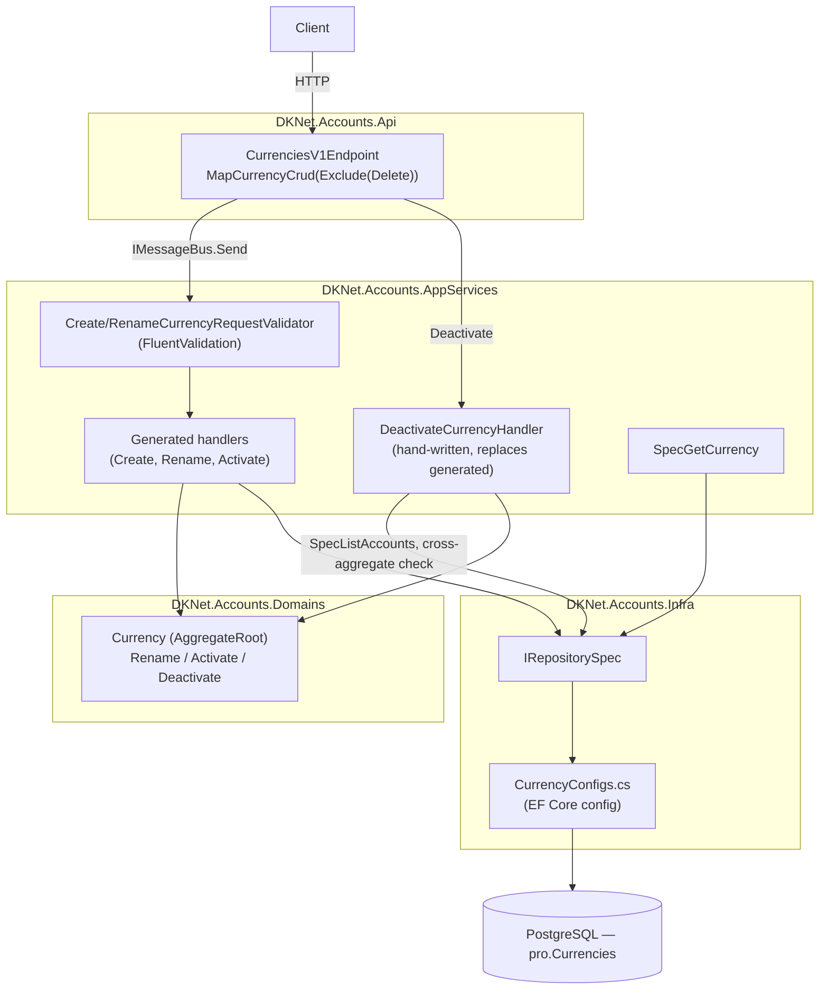
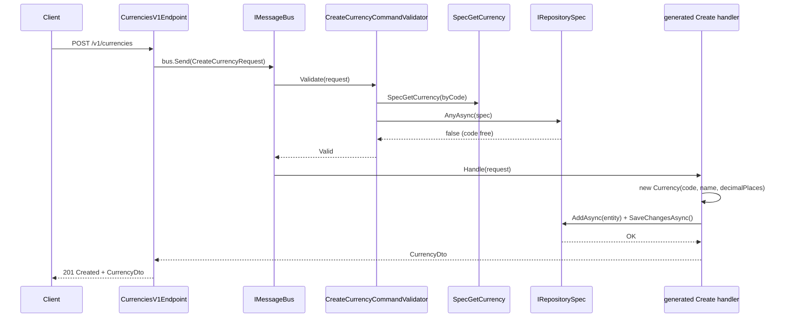
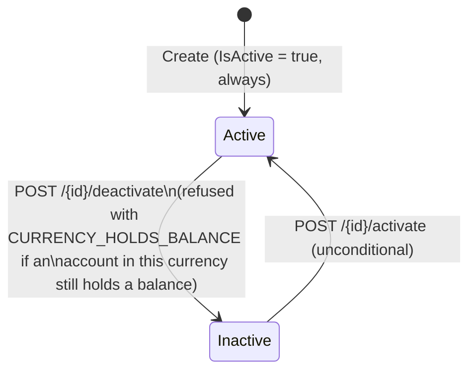

# Currencies — Architecture

> Diagrams below are Mermaid, pending an archify render — no diagram is skipped.

## Vertical Slice Overview

The whole slice, Create through Deactivate, is one generated composite route
(`group.MapCurrencyCrud(o => o.Exclude(CrudOp.Delete))`,
`ApiEndpoints/DKNet.Accounts.Api/ApiEndpoints/Currencies/CurrenciesV1Endpoint.cs`) except for one
hand-written handler that replaces the generated one for Deactivate.

## Create Currency — Sequence Diagram

`CreatedBy`/`UpdatedBy` are not shown: no request in this slice carries an acting-user field, and the
audit hook stamps them from the caller's credential on `SaveChanges`, never from the handler.

## Status State Machine

`IsActive` is a plain boolean, not an enum, but it does gate behaviour: `Activate()`/`Deactivate()`
are the only two writers, both `[CrudAction]` routes.

`Deactivate()` on the entity itself carries no guard — the `CURRENCY_HOLDS_BALANCE` check runs in
`DeactivateCurrencyHandler` before the entity method is called, because it queries a different
aggregate (`Account`) than the one being mutated.

## Layer Responsibilities

| Layer | Responsibility in this feature |
|-------|-------------------------------|
| `DKNet.Accounts.Api` | One composite route registration; no business logic |
| `DKNet.Accounts.AppServices` | Validators (code uniqueness, decimal-places range 0–6); the one hand-written handler (Deactivate) |
| `DKNet.Accounts.Domains` | `Currency` entity: `Rename`, `Activate`, `Deactivate` |
| `DKNet.Accounts.Infra` | `CurrencyConfigs` EF mapping; seed data for the 26 shipped currencies |
