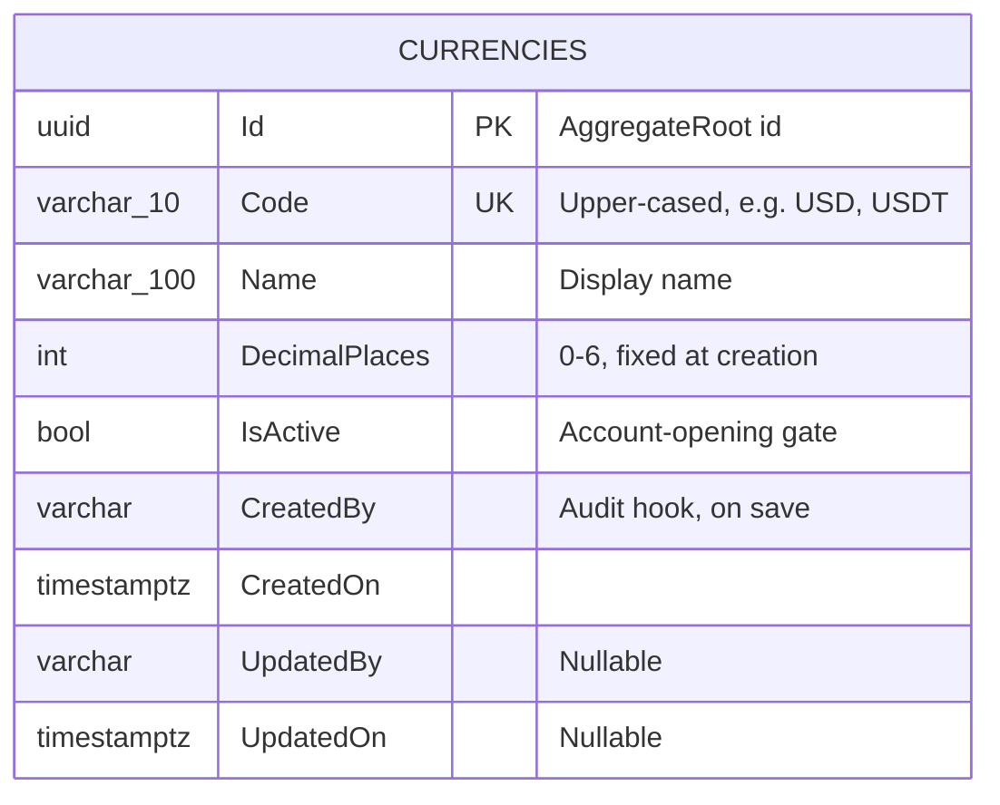

# Currencies — Data Model

## Entity Relationship Diagram

`Currency` carries no foreign key of its own — `Account.CurrencyCode` (see
[Accounts' data model](../accounts/data-model.md)) references `Currency.Code` by value, not by a
mapped EF Core relationship, so there is no navigation property either direction.

## Properties

| Field | Column | DB type | Length / precision | Required | Key / index | Default | Purpose |
|---|---|---|---|---|---|---|---|
| `Id` | `Id` | uuid | — | ✓ | PK | new Guid | Service-generated identifier |
| `Code` | `Code` | varchar | 10 | ✓ | unique (`IX_Currencies_Code`) | — | The currency's identity; upper-cased on write so lookups are case-insensitive |
| `Name` | `Name` | varchar | 100 | ✓ | — | — | Human-readable display name |
| `DecimalPlaces` | `DecimalPlaces` | int | — | ✓ | — | — | The precision every posting amount in this currency is validated against; immutable after creation |
| `IsActive` | `IsActive` | bool | — | ✓ | — | `true` | Whether new accounts may open in this currency |
| `CreatedBy`/`UpdatedBy` | same | varchar | — | `CreatedBy` required, `UpdatedBy` nullable | — | — | Who created/last touched the row — stamped by the audit hook, never by a request field ([auditing note](#audit-fields)) |
| `CreatedOn`/`UpdatedOn` | same | timestamptz | — | `CreatedOn` required, `UpdatedOn` nullable | — | — | When the row was created/last touched |

## EF Core Mapping Configuration

Source: `ApiEndpoints/DKNet.Accounts.Infra/Features/Currencies/Mappers/CurrencyConfigs.cs`

| Configuration | Value | Reason |
|---|---|---|
| Table | `Currencies`, schema `pro` (`DomainSchemas.Profile`) | Convention |
| Unique index | `Code` | Business uniqueness — a duplicate is `422 DUPLICATE_CURRENCY_CODE` |
| Column length | `Code` ≤ 10, `Name` ≤ 100 | `HasMaxLength` |
| `CreatedBy`/`UpdatedBy`/`CreatedOn`/`UpdatedOn` | inherited from the shared audited-entity base configuration | Not re-declared per entity; see `base.Configure(builder)` |

## Validation Rules

| Field | Rule | Enforcement |
|-------|------|-------------|
| `Code` | 3–10 letters, must not already exist (case-insensitive) | `CreateCurrencyCommandValidator` (FluentValidation) |
| `Name` | Non-empty, ≤ 100 characters | `CreateCurrencyCommandValidator` / `RenameCurrencyRequestValidator` |
| `DecimalPlaces` | 0–6 inclusive | `CreateCurrencyCommandValidator` |
| `DecimalPlaces` immutability | No `ChangeDecimalPlaces` method exists — every stored money value elsewhere rounds against the value set at creation | Enforced by omission, not by a runtime check |

## Status Values

| Value | Meaning | Reached by | Next |
|-------|---------|------------|------|
| `IsActive = true` | New accounts may open in this currency | Create (always), or `POST /{id}/activate` | `IsActive = false` |
| `IsActive = false` | Existing accounts and postings in this currency are unaffected; new accounts may not open in it | `POST /{id}/deactivate`, refused with `CURRENCY_HOLDS_BALANCE` while any account in this currency holds a non-zero balance or held amount | `IsActive = true` |

## Audit fields

Every aggregate in this service — `Currency` included — derives from `AuditedEntity<Guid>` via
`AggregateRoot`. `CreatedBy`/`UpdatedBy` are stamped by `DKNet.EfCore.AuditLogs`' audit hook from the
authenticated caller's credential on `SaveChanges`; no request in this slice carries an acting-user
field for a caller to set. A save whose caller cannot be attributed is refused with `403`
(`OwnershipRequiredException`) rather than writing an unattributed row.
