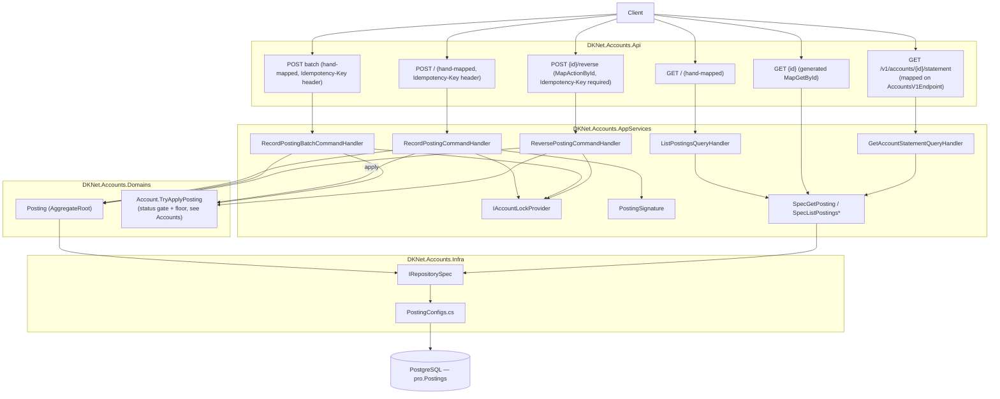
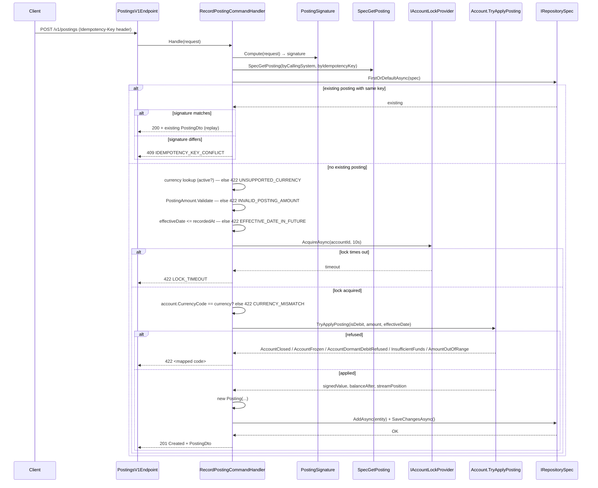

# Postings — Architecture

> Diagrams below are Mermaid, pending an archify render — no diagram is skipped.

## Vertical Slice Overview

Only one route in this slice is generated (`GET /v1/postings/{id}`, via the generic
`MapGetById<Posting, Guid, PostingDto>`); every other route — list, record, batch, reverse, and the
statement route mapped on the accounts group — is hand-written, because each carries orchestration a
generator cannot express: a lock, an idempotency replay, or a cross-aggregate refusal.



## Record a Posting — Sequence Diagram

The main write route for this feature, from the endpoint through the lock, the idempotency check, the
account's own rules, to the database and back.



## Reverse a Posting — Sequence Diagram

```mermaid
sequenceDiagram
    participant C as Client
    participant HDL as ReversePostingCommandHandler
    participant SIG as PostingSignature
    participant LOCK as IAccountLockProvider
    participant ORIG as original Posting
    participant ACCT as Account.TryApplyPosting(isReversal: true)
    participant REPO as IRepositorySpec

    C->>HDL: POST {id}/reverse (reason, Idempotency-Key required)
    HDL->>SIG: Hash("reverse|{id}|{reason}")
    HDL->>REPO: replay/conflict pre-check (same shape as Record)
    HDL->>LOCK: AcquireAsync(original.AccountId, 10s)
    HDL->>ORIG: re-read tracked, inside the lock
    alt already reversed
        ORIG-->>HDL: Status == Reversed
        HDL-->>C: 422 POSTING_ALREADY_REVERSED
    else not yet reversed
        HDL->>ACCT: TryApplyPosting(opposite direction, original.Amount, isReversal: true)
        Note over ACCT: floor check skipped — a reversal may leave the account\nbelow floor — but status gate still applies
        alt status refuses (Closed / Frozen / wrong-direction Dormant)
            ACCT-->>HDL: refused
            HDL-->>C: 422 <mapped code>
        else applied
            HDL->>HDL: new reversal Posting; reversal.LinkAsReversalOf(original.Id)
            HDL->>ORIG: original.MarkReversedBy(reversal.Id)
            HDL->>REPO: SaveChangesAsync()
            HDL-->>C: 200 + reversal PostingDto
        end
    end
```

## The per-account lock

`IAccountLockProvider` (`Domains/Services/IAccountLockProvider.cs`), implemented by
`AccountLockProvider` (`Infra/Services/AccountLockProvider.cs`) as a
`ConcurrentDictionary<Guid, SemaphoreSlim>` keyed per account id.

> ponytail: this is a **single-process, in-memory lock** — correct for one running instance, not for
> a horizontally-scaled deployment, where two instances could each acquire "their own" lock for the
> same account. Upgrade path: a database-level advisory lock (e.g. Postgres
> `pg_advisory_xact_lock`), or an optimistic unique-index-plus-retry scheme, if this service is ever
> scaled to more than one instance.

The idempotency pre-check runs *before* the lock is acquired (a deliberate, documented trade-off): two
first-uses of the same key can both miss that read, and the second is then refused `409` by the
database's own unique index on `(CallingSystem, IdempotencyKey)` rather than replayed — a narrow,
accepted race, not a silent double-post.

## Status State Machine

```mermaid
stateDiagram-v2
    [*] --> Posted : Record / RecordBatch (always)
    Posted --> Reversed : POST {id}/reverse\n(refused POSTING_ALREADY_REVERSED if already reversed;\nrefused per the account's own status gate)
```



`Reversed` is terminal — `MarkReversedBy` throws if called twice, so a posting can be reversed at most
once.

## Layer Responsibilities

| Layer | Responsibility in this feature |
|-------|-------------------------------|
| `DKNet.Accounts.Api` | Route mapping only — one generated read, four hand-mapped routes plus the statement route on the accounts group |
| `DKNet.Accounts.AppServices` | Locking, idempotency replay/conflict, every business-rule check and its `LedgerErrors` code, the 90-day list-window validator |
| `DKNet.Accounts.Domains` | `Posting` entity (immutable once written, except the one-way `MarkReversedBy`); the status-gate and floor rules live on `Account`, not here |
| `DKNet.Accounts.Infra` | `PostingConfigs` EF mapping — the three indexes the ledger's invariants depend on (gapless stream position, idempotency, posting number) |
