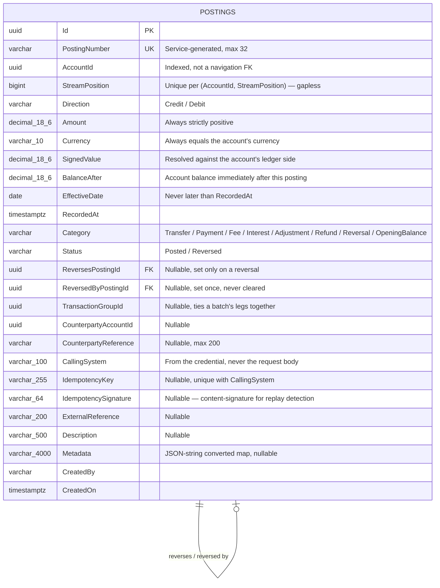

# Postings — Data Model

## Entity Relationship Diagram



`Posting` has no `UpdatedBy`/`UpdatedOn` semantics of its own beyond the base audited-entity columns —
in practice a posting row is never updated after insert except the one-way `Status`/
`ReversedByPostingId` pair `MarkReversedBy` sets.

## Properties

| Field | Column | DB type | Length / precision | Required | Key / index | Default | Purpose |
|---|---|---|---|---|---|---|---|
| `Id` | `Id` | uuid | — | ✓ | PK | new Guid | Service-generated identifier |
| `PostingNumber` | `PostingNumber` | varchar | 32 | ✓ | unique | — | Service-generated, unique across the service |
| `AccountId` | `AccountId` | uuid | — | ✓ | indexed | — | The account this posting moves |
| `StreamPosition` | `StreamPosition` | bigint | — | ✓ | unique per `(AccountId, StreamPosition)` | — | This posting's position in the account's stream — gapless, so a missing entry is detectable |
| `Direction` | `Direction` | varchar (`HasConversion<string>`) | — | ✓ | — | — | `Credit`/`Debit` — the direction, not the amount's sign, says which way money moved |
| `Amount` | `Amount` | decimal | 18,6 | ✓ | — | — | Always strictly positive, never finer than the currency permits |
| `Currency` | `Currency` | varchar | 10 | ✓ | — | — | Always equal to the account's currency |
| `SignedValue` | `SignedValue` | decimal | 18,6 | ✓ | — | — | The amount resolved against the account's ledger side — what sums to the balance. See [Signed amount resolution](#signed-amount-resolution) |
| `BalanceAfter` | `BalanceAfter` | decimal | 18,6 | ✓ | — | — | The account's balance immediately after this posting |
| `EffectiveDate` | `EffectiveDate` | date | — | ✓ | indexed with `AccountId`+`StreamPosition` | — | May be backdated; never later than `RecordedAt` |
| `RecordedAt` | `RecordedAt` | timestamptz | — | ✓ | — | — | The moment the service recorded it |
| `Category` | `Category` | varchar (`HasConversion<string>`) | — | ✓ | — | — | One of eight business categories |
| `Status` | `Status` | varchar (`HasConversion<string>`) | — | ✓ | — | `Posted` | `Posted` or `Reversed` once a reversal has been written against it |
| `ReversesPostingId` | `ReversesPostingId` | uuid | — | — | FK → `Postings.Id` | — | Set only on a reversal |
| `ReversedByPostingId` | `ReversedByPostingId` | uuid | — | — | FK → `Postings.Id` | — | Set once by `MarkReversedBy`, never cleared |
| `TransactionGroupId` | `TransactionGroupId` | uuid | — | — | — | — | Ties every leg of one batch together |
| `CounterpartyAccountId` | `CounterpartyAccountId` | uuid | — | — | — | — | The other side, when it is an account inside this service |
| `CounterpartyReference` | `CounterpartyReference` | varchar | 200 | — | — | — | The other side, when it is outside this service |
| `CallingSystem` | `CallingSystem` | varchar | 100 | ✓ | unique with `IdempotencyKey` | — | The system that recorded this posting — from the credential, never the request body |
| `IdempotencyKey` | `IdempotencyKey` | varchar | 255 | — | unique with `CallingSystem` (`IX_Postings_CallingSystem_IdempotencyKey`) | — | The key that calling system supplied, scoped to it |
| `IdempotencySignature` | `IdempotencySignature` | varchar | 64 | — | — | — | Content signature computed at write time — never returned in `PostingDto` |
| `ExternalReference` | `ExternalReference` | varchar | 200 | — | — | — | Caller's own reference for this posting |
| `Description` | `Description` | varchar | 500 | — | — | — | Narrative description; a reversal's `reason` is stored here |
| `Metadata` | `Metadata` | varchar (JSON string) | 4000 | — | — | — | Free-form key/value pairs |
| `CreatedBy` | `CreatedBy` | varchar | — | ✓ | — | — | Stamped by the audit hook, never by a request field |
| `CreatedOn` | `CreatedOn` | timestamptz | — | ✓ | — | — | When the row was created |

`PostingDto` excludes `SignedValue` and `IdempotencySignature` from the generated shape, then
re-declares `SignedValue` by hand as the response field `signedAmount` (a Mapster rename) —
`IdempotencySignature` never reaches the response at all.

## EF Core Mapping Configuration

Source: `ApiEndpoints/DKNet.Accounts.Infra/Features/Postings/Mappers/PostingConfigs.cs`

| Configuration | Value | Reason |
|---|---|---|
| Table | `Postings`, schema `pro` | Convention |
| Unique index | `PostingNumber` | Service-wide uniqueness |
| Unique index | `(AccountId, StreamPosition)` | The gapless-stream invariant — a consumer can detect a missing entry |
| Index | `(AccountId, EffectiveDate, StreamPosition)` | Backs the statement read's date-bounded, stream-ordered page |
| Unique index | `(CallingSystem, IdempotencyKey)` | The idempotency backstop: a second first-use racing the pre-lock read is refused here, not silently double-posted |
| Enum storage | `Direction`, `Category`, `Status` as strings | Readable in the database, stable across enum reordering |
| Money precision | `Amount`, `SignedValue`, `BalanceAfter` → `HasPrecision(18, 6)` | Matches `PostingAmount.Ceiling` and every currency's maximum 6 decimal places |

## Validation Rules

| Field | Rule | Enforcement |
|-------|------|-------------|
| `amount` | Strictly positive, decimal places ≤ the currency's | `PostingAmount.Validate` → `422 INVALID_POSTING_AMOUNT` (both conditions share this one code) |
| `amount` | Never above 999,999,999,999.999999 | `PostingAmount.ExceedsCeiling` → `422 AMOUNT_OUT_OF_RANGE` |
| `currency` | Must equal the account's own currency | Handler check → `422 CURRENCY_MISMATCH` |
| `effectiveDate` | Never later than the recording date | Handler check → `422 EFFECTIVE_DATE_IN_FUTURE` |
| Account status | Closed refuses everything; Frozen refuses everything; Dormant refuses a debit | `AccountPostingPolicy.StatusGate` → `422 ACCOUNT_CLOSED` / `ACCOUNT_FROZEN` / `ACCOUNT_DORMANT_DEBIT_REFUSED` |
| Floor | A debit past the account's floor is refused, except on a reversal | `AccountFloorPolicy.Floor` → `422 INSUFFICIENT_FUNDS` |
| Reversal target | At most one reversal per posting | `MarkReversedBy` (one-way) → `422 POSTING_ALREADY_REVERSED` |
| Idempotency | Same key + same content replays; same key + different content conflicts | `PostingSignature.Compute`/`Hash` comparison → `409 IDEMPOTENCY_KEY_CONFLICT` |
| Per-account lock | 10-second timeout | `IAccountLockProvider.AcquireAsync` → `422 LOCK_TIMEOUT` |

### Signed amount resolution

`SignedValue` is computed by `AccountPostingPolicy.SignedValue` (on `Account`, not `Posting`) before
the posting is constructed:

```csharp
public static decimal SignedValue(AccountClassification classification, bool isDebit, decimal amount)
{
    var debitIncreases = classification is AccountClassification.Asset or AccountClassification.Expense;
    var increases = isDebit == debitIncreases;
    return increases ? amount : -amount;
}
```

A credit raises a `Liability`, `Equity` or `Income` account and lowers an `Asset` or `Expense` one; a
debit is the opposite. This is why a *credit* — not a debit — is what `INSUFFICIENT_FUNDS` refuses on
a fresh `Asset` account with a floor of zero: `direction` alone never tells you the sign.

## Status Values

| Value | Meaning | Reached by | Next |
|-------|---------|------------|------|
| `Posted` | The normal, correctable state | `POST /v1/postings`, `POST /v1/postings/batch` (always) | `Reversed` |
| `Reversed` | Terminal — `MarkReversedBy` throws if called on an already-reversed posting | `POST /v1/postings/{id}/reverse` | none — a reversal can itself never be reversed as the *original* side of another reversal |
